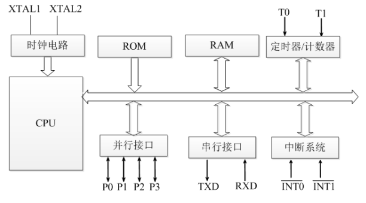
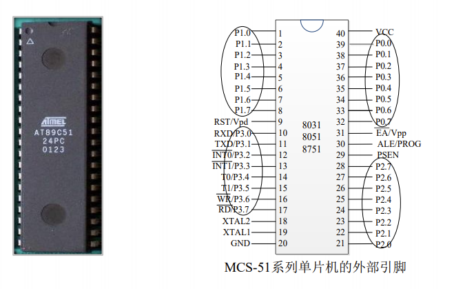

# 51单片机的型号与组成

## 组成

## 型号

### 51系列

> 它们的指令系统和芯片引脚完全兼容，仅片内的程序存储器容量有所不同。

- 8031：无ROM
- 8051：4kb的PROM
- 8751：4kb的EPROM

### 52系列

> 基本与51系列相同，片内数据存储器增至256字节。

- 8032：无ROM
- 8052：8kb的PROM
- 8752：8kb的EPROM

## 引脚及功能说明

### I/O引脚

- P0口（39\~32脚）：P0.0\~P0.7统称为P0口。在不接片外存储器与不拓展I/O口时，作为双向输入/输出口。在接有片外存储器或拓展I/O口时，P0口分时复用为低8位地址总线和双向数据总线。

- P1口（1\~8脚）：P1.0\~P1.7统称为P1口，可作为双向I/O口使用。

- P2口（21\~28脚）：P2.0\~P2.7统称为P2口，一般可作为双向I/O口使用；在拓展片外存储器时，P2口可用作高8位地址总线。

- P3口（10\~17脚）：P3.0\~P3.7统称为P3口，除作为双向I/O口使用外，还可以将每一位用于第二功能。

  | P3口  | 第二功能                             |
  | :---: | :----------------------------------- |
  | P3.0  | RXD 串行口输入端                     |
  | P3.1  | TXD 串行口输出端                     |
  | P3.2  | INT0 外部中断0请求输入端，低电平有效 |
  | P3.3  | INT1 外部中断1请求输入端，低电平有效 |
  | P3.4  | T0 定时/计数器0外部计数脉冲输入端    |
  | P3.5  | T1 定时/计数器1外部计数脉冲输入端    |
  | P3.6  | WR 外部数据存储器写信号，低电平有效  |
  | P3.7  | RD 外部数据存储器读信号，低电平有效  |

### 控制线 

- ALE（30脚）：地址锁存信号输出端。

- PESN（29脚）：片外程序存储器读选通信号输出端。

- RST（9脚）：当单片机振荡器工作室，该引脚上出现持续10ms以上的高电平，就可实现复位操作，使单片机回复到初始状态。

- EA（31脚）：EA为片外程序存储器选用端。该引脚低电平时，选用片外程序存储器，高电平或悬空时，选用片内程序存储器。

### 主电源引脚

- VCC（40脚）：接+5V电源。
- GND（20脚）：接地。

### 外接晶体引脚

XTAL1、XTAL2（19、18脚）：当使用单片机内部振荡电路时，这两个引脚用来外接石英晶体和微调电容。在单片机内部，它是一个反相放大器的输入端，这个放大器构成了片内振荡电路。当采用外部时钟时，对于HMOS单片机，XTAL1引脚接地，XTAL2接片外振荡脉冲输入；对于CHMOS单片机，XTAL2引脚接地，XTAL1接片外振荡脉冲输入。