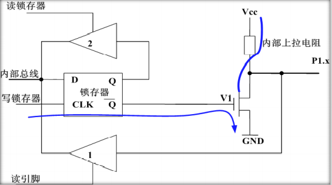
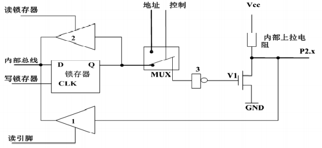
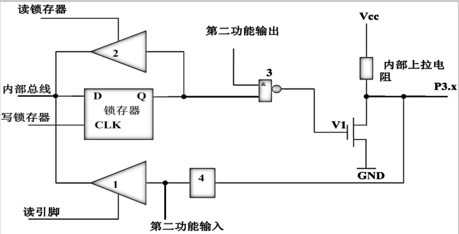
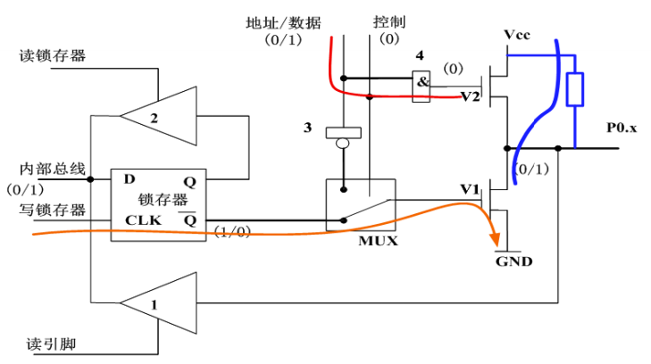

# 51单片机的并行IO口工作原理

**MCS-51系列单片机 有4 个8位的并行 I/O 接口P0 、P1、 P2和 P3。它们既可以作为输入，也可以作为输出，既可按8位处理，也可按位方式使用。输出时具有锁存能力，输入时具有缓冲功能。**

## P1口

P1口是准双向口，只能作通用I/O接口使用。当P1口输出时，可以提供电流负载。P1口具有驱动4个TTL负载芯片。I/O口读入之前，先输出1，再读入。

## P2口

P2口也是准双向口，它有两种用途：通用I/O接口和高8位地址线。它的1位的结构如图所示，与P1口相比，它只在输出驱动电路上比P1口多了一个模拟转换开关MUX和反相器3。当CPU发出控制信号低电平“0”，使多路开关MUX倒向存储器，P2口作为通用I/O接口使用，与P1口类似。当CPU发出控制信号高电平“1”，使多路开关MUX倒向内部地址线，P2口作为高8位地址总线使用。

## P3口

P3口作为普通I/O口工作时，与P1口原理相同。除作为准双向通用I/O口使用外，它的每一根线还具有第二种功能。当P3口作为第二功能时，锁存器的Q输出端必须为高电平。

| P3口 | 第二功能                             |
| :--: | :----------------------------------- |
| P3.0 | RXD 串行口输入端                     |
| P3.1 | TXD 串行口输出端                     |
| P3.2 | INT0 外部中断0请求输入端，低电平有效 |
| P3.3 | INT1 外部中断1请求输入端，低电平有效 |
| P3.4 | T0 定时/计数器0外部计数脉冲输入端    |
| P3.5 | T1 定时/计数器1外部计数脉冲输入端    |
| P3.6 | WR 外部数据存储器写信号，低电平有效  |
| P3.7 | RD 外部数据存储器读信号，低电平有效  |

## P0口

P0口是一个三态双向口，可作为地址/数据分时复用口，也可作为通用的II/O接口。它包括一个输出锁存器、两个三态缓冲器、输出驱动电路和输出控制电路。当控制信号为低电平“0”时，P0口作为通用I/O口使用。当控制信号为高电平“1”时，P0口作为地址/数据分时复用总线用。

> P0口作通用I/O接口时，应注意以下两点：
>
> - 在输出数据时，由于V2截止，输出级时漏极开路电路，要使“1”信号正常输出，必须外接上拉电阻。
> - 在输入数据前，应先向P0口写“1”，此时锁存器的Q端为“0”，使输出级的两个场效应管V1、V2均截止，引脚处于悬浮状态，才可作高阻输入。