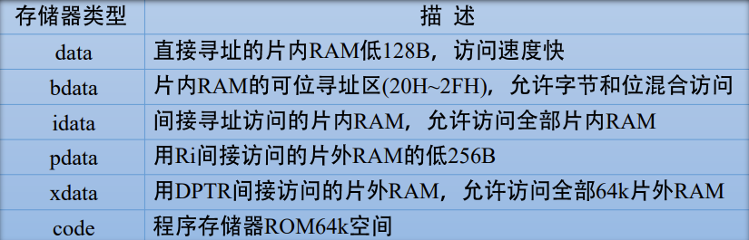

# 单片机C51中新增的变量类型

> -----------
>
> 用C语言编写单片机应用程序与标准的C语言程序有相应的区别：编写单片机应用程序时，需根据单片机存储结构及内部资源定义相应的数据类型和变量，而标准的C语言程序一般不需要考虑这些问题。
>
> -----------
>
> C51包含的数据类型、变量存储模式、输入输出处理、函数等方面与标准的C语言有一定的区别。其他的语法规则、程序结构及程序设计方法等与标准的C语言程序设计相同。
>
> -----------

## C51程序与标准的C程序在以下几个方面不一样：

- C51中增加了集中针对MCS-51单片机特有的数据类型；
- C51中变量的存储模式与51单片机的存储器紧密相关，定义变量时需要明确指定存储器属性；
- 在函数的使用方面，C51中有专门的中断函数，并定义了专门的关键字和语法规则。

## C51新增的变量类型

### 特殊功能寄存器型（sfr，sfr16）

51单片机内有许多特殊功能寄存器，通过这些特殊功能寄存器可以控制单片机的定时器、计数器、串口、I/O及其他功能部件，每一个特殊功能寄存器在片内RAM中都对应于单元。

在C51中，允许用户对这些特殊功能寄存器进行访问，访问时须通过sfr或sfr16类型说明符进行定义，定义时须知名它们所对应的片内RAM单元的地址。格式为：

 `sfr/sfr16 <特殊功能寄存器名> = <地址>;` 

为了方便用户，C51编译器把51单片机的常用特殊功能寄存器和特殊位进行了定义，放在“reg51.h”或“reg52.h”头文件中，用户使用时，只需用预处理命令#include把头文件包含到程序中即可。

### 位变量

在C51中，允许用户通过位类型符定义位变量。位类型符有两个：bit和sbit，它们在内存中都只占一个二进制位。bit位类型符用于定义一般的可位处理变量。它的格式如下：

`bit <位变量名>;`

## C51变量定义时的存储模式设置

在C51中，变量在定义时需指出变量的数据类型和存储器类型。定义的格式如下：

`数据类型说明符 [存储器类型] <变量名> [= 初值];`

例如：

`char data var1; // 在片内RAM低128B定义用直接寻址方式访问的字符型变量var1` 

`int idata var2; // 在片内RAM256B定义用间接寻址方式访问的整型变量var2` 

`int code var5; // 在ROM空间定义整型变量var5`

`unsigned char bdata var6; // 在片内RAM位寻址区20H~2FH单元定义可字节处理和位处理的无符号字符型变量var6`