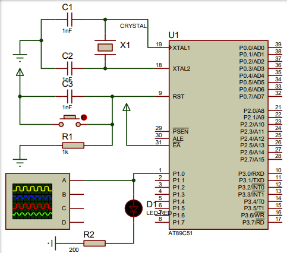

# 单片机的定时/计数器的控制接口

## 定时/计数器的编程

1. 根据要求选择方式，确定方式控制字，写入TMOD寄存器。
2. 根据要求计算定时/计数器的计数值，再求得计数初值，写入初值寄存器。
3. 根据需要，开放定时/计数器中断选项。
4. 设置定时/计数器控制寄存器TCON，启动定时器。
5. 等待定时时间到，如用查询处理则编写查询程序判断溢出标志，溢出标志等于1。如用中断方式处理，编写中断服务程序。

## 定时/计数器的应用举例

> 利用定时器产生周期性的动作的基本思想：产生周期性的定时，定时时间到做相应的处理，例如产生周期性的方波，只需定时对输出端取反一次即可。

### **[例1]** 设系统时钟频率为12MHz，用定时/计数器T0编程实现从P1.0输出周期为500μs的方波。

**[分析]** 从P1.0输出周期为500μs的方波，只需P1.0每250μs取反一次则可。当系统时钟为12MHZ，定时器T0工作于方式2时，最大的定时时间为256μs，满足250μs的定时要求。方式控制字应设定为00000010B(02H)。系统时钟为12MHZ，定时250μs，计数值N为250,初值`X = 256 - 250 = 6`，则`TH0 = TL0 = 06H`。

**[硬件电路图]** 


**[参考源码]**

- 采用查询方式处理：
```c
#include <reg51.h>
sbit P1_0 = P1^0;
void main()
{
	char i;
	TMOD = 0x02;
	TH0 = 0x06;
	TL0 = 0x06;
	TR0 = 1;
	for ( ; ; )
	{
		if (TF0)
		{
			TF0 = 0;
			P1_0 = ! P1_0;
		} // 查询计数溢出
	}
}
```

- 采用中断方式处理：
```c
#include <reg51.h>
sbit P1_0 = P1^0;
void main()
{
	TMOD = 0x02;
	TH0 = 0x06;
	TL0 = 0x06;
    EA = 1;
	ET0 = 1;
    TR0 = 1;
	while(1);
}
void time0_int(void) interrupt 1 // 中断服务程序
{
    P1_0 = ! P1_0;
}
```


> 如果定时时间大于65536μs，这时用一个定时/计数器直接处理不能实现，可用两个定时/计数器共同处理或一个定时/计数器配合软件计数方式处理。

### [例2] 设系统时钟频率为12MHz，编程实现从P1.1输出周期为1s的方波。

**[分析]** 由于定时时间较长，一个定时/计数器不能直接实现，可用定时/计数器T0产生周期性为10ms的定时，然后用一个寄存器R2对10ms计数50次或用定时/计数器T1对10ms计数50次实现。系统时钟为12MHZ，定时/计数器T0定时10ms，计数值N为10000，只能选方式1，方式控制字为00000001B(01H)，初值X：`X = 65536 - 10000 = 55536 = 1101 1000 1111 0000B`，则`TH0 =1 101 1000B = D8H; TL0 = 1111 0000B = F0H`。

**[参考源码]**

```c
#include <reg51.h>
sbit P1_1 = P1^1;
char i;
void main()
{
    TMOD = 0x01;
    TH0 = 0xD8;
    TL0 = 0xF0;
    EA = 1;
    ET0 = 1;
    TR0 = 1;
    i = 0;
    while(1);
}
void time0_int(void) interrupt 1 // 中断服务程序
{
    TH0 = 0xD8;
    TL0 = 0xF0;
    i++;
    if (i == 50)
    {
        P1_1 = ! P1_1;
        i = 0;
    }
}
```

