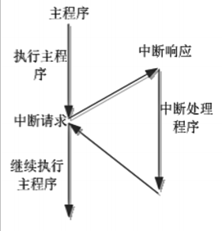
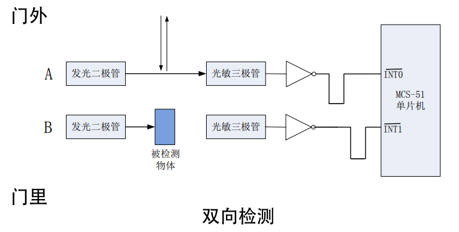

# MCS-51单片机中断系统介绍

## 中断的基本概念

当CPU正在处理一件事A时，发生了另外一件事B，CPU暂时中断正在执行的程序，转去执行预先设定的处理事件B的程序；处理完毕后，再回到事件A被暂停的程序位置继续处理。这一过程就是中断。

## 中断源

### 外部中断 $\overline{INT0}$ 和 $\overline{INT1}$

外部引脚P3.2和P3.3输入，有两种触发方式：**电平触发**及**跳变(边沿)触发**。由特殊功能寄存器TCON来管理。

| TCON    | D7   | D6   | D5   | D4   | D3   | D2   | D1   | D0   |
| ------- | ---- | ---- | ---- | ---- | ---- | ---- | ---- | ---- |
| （88H） | TF1  | TR1  | TF0  | TR0  | IE1  | IT1  | IE0  | IT0  |

- IT0(IT1)：外部中断触发方式设置位。被设置为0，则选择外部中断为电平触发方式；被设置为1，则选择外部中断为边沿触发方式。
- IE0(IE1)：外部中断0(或1)的中断请求标志位。
- 在电平触发方式时，CPU在每个机器周期采样P3.2，若引脚为低电平，则IE0(IE1)置1，向CPU请求中断；CPU响应后能够由硬件自动将IE0(或IE1)清零。
- 在边沿触发方式时，若第一个机器周期采样到P3.2引脚为高电平，第二个机器周期采样为低电平时，由IE0(或IE1)置1，向CPU请求中断。

#### [实例] 光电式自动迎宾器

> 在门框两侧安装对射式光电传感器，当顾客进出时，身体遮挡了光源发出红外光，传感器输出的高低电平，单片机检测到电平变化，进而播放不同的提示音。

### 定时/计数器T0和T1中断

当定时/计数器T0(或T1)溢出时，由硬件置TF0(或TF1)为1，向CPU发送中断请求，当CPU响应中断后，将由硬件自动清除TF0(或TF1)。

### 串行口中断

MCS-51的串行口中断源对应两个中断标志位：串行口发送中断标志位TI和串行口接收中断标志位RI。无论哪个标志位置“1”，都请求串行口中断，到底是发送中断TI还是接收中断RI，只有在中断服务程序中通过指令查询来判断。

### 定时/计数器T2中断

只针对52系列单片机。当定时/计数器T2溢出时，向CPU发送中断请求。

## 中断允许控制

MCS-51单片机中没有专门的开中断和关中断指令，对各个中断源的允许和屏蔽是由内部的中断允许寄存器IE的各位来控制的。

| IE    | D7   | D6   | D5   | D4   | D3   | D2   | D1   | D0   |
| ----- | ---- | ---- | ---- | ---- | ---- | ---- | ---- | ---- |
| (A8H) | EA   |      | ET2  | ES   | ET1  | EX1  | ET0  | EX0  |

- EA(Enable All)：中断允许控制位。
- ET2、ET1、ET0：定时器/计数器T2、T1、T0的溢出中断允许位。
- ES：串行口中断允许位。
- EX1、EX0：外部中断INT1、INT0的中断允许位。

> 系统对各中断源默认的优先权顺序：
>
> | 中断源            | 优先级(默认)顺序 |
> | ----------------- | :--------------: |
> | 外部中断0         |       最高       |
> | 定时/计数器T0中断 |        ↓         |
> | 外部中断1         |        ↓         |
> | 定时/计数器T1中断 |        ↓         |
> | 串行口中断        |        ↓         |
> | 定时/计数器T2中断 |       最低       |

## 优先权控制

每个中断源由两级控制：高优先级和低优先级。通过内部的中断优先级寄存器IP来设置。中断优先级寄存器IP(Interrupt Priority)的字节地址为B8H，可以进行位寻址。

| IP    | D7   | D6   | D5   | D4   | D3   | D2   | D1   | D0   |
| ----- | ---- | ---- | ---- | ---- | ---- | ---- | ---- | ---- |
| (B8H) |      |      | PT2  | PS   | PT1  | PX1  | PT0  | PX0  |

- PT2、PT1、PT0：定时器T2、T1、T0的中断优先级控制位。
- PS：串行口的中断优先级控制位。
- PX1、PX0：外部中断INT1、INT0的中断优先级控制位。

如果IP的某一位被置1，表示对应中断源被设为高优先级；否则为低优先级。

> 对于中断优先权和中断嵌套，MCS-51单片机由以下三条规则：
>
> 1. 正在进行的中断过程不能被新的同级或低优先级的中断请求所中断，一直到该中断服务程序结束，返回了主程序后，CPU才响应新的中断请求。
>
> 2. 正在进行的低优先级中断服务程序能被高优先级中断请求所中断，实现两级中断嵌套。
>
> 3. CPU同时接收到几个中断请求时，首先响应优先级最高的中断请求。
>
> -------------------
>
> 各中断服务的入口地址：
>
> | 中断源                   | 入口地址 |
> | ------------------------ | -------- |
> | 外部中断0                | 0003H    |
> | 定时/计数器0             | 000BH    |
> | 外部中断1                | 0013H    |
> | 定时/计数器1             | 001BH    |
> | 串行口                   | 0023H    |
> | 定时/计数器2（仅52系列） | 002BH    |

## 中断响应时间

中断响应时间是指CPU检测到中断请求信号到转入中断服务程序入口所需要的机器周期。**51单片机响应中断的最短时间为3个机器周期。**
