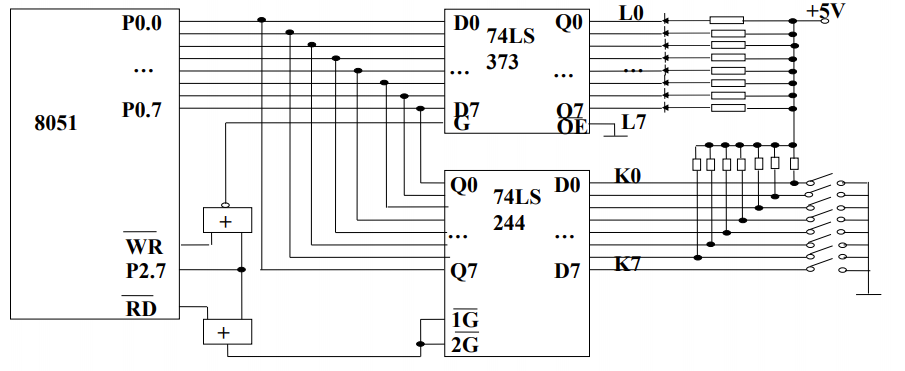

# 单片机总线扩展I/O口

## 输入/输出口扩展

### 简单I/O口扩展

通常通过数据缓冲器、锁存器来拓展简单I/O接口。例如：74LS373、74LS244、74LS273、74LS245等芯片都可以作简单I/O扩展。

## 绝对地址的访问

### 使用C51运行库中预定义宏

CS1编译器提供了一组宏定义来对51系列单片机的code、xdata空间进行绝对寻址。规定只能以无符号数方式访问，定义了宏定义，其函数原型如下:

`#define CBYTE ((unsigned char volatile *)0x50000L)`

`#define XBYTE ((unsigned char volatile *)0x20000L)`

`#define CWORD ((unsigned int volatile *)0x50000L)`

`#define XWORD ((unsigned int volatile *)0x20000L)`

这些函数原型放在absacc.h文件中。使用时须用预处理命令把该文件包含到文件中，形式为：`#include <absacc.h>`。

其中：CBYTE以字节形式对code区寻址；XBYTE以字节形式对xdata区寻址；CWORD以字形式对code区寻址；XWORD以字形式对xdata区寻址。

### [例] 绝对地址对存储单元的访问

```c
#include <absacc.h>
#include <reg51.h>
void main(void)
{
    unsigned char var1;
    unsigned int var2;
    var1 = XBYTE[0x0005]; // 访问片外RAM的0005字节单元
    var2 = XWORD[0x0002]; // 访问片外RAM的0002字单元
}
```



图中，扩展的输入口接了K0\~K7 8个开关，扩展的输出口接了L0\~L7 8个发光二极管，如果要实现K0\~K7开关的状态通过L0\~L7发光二极管显示：

```c
#include <reg51.h>
#include <absacc.h>
#define uchar unsigned char
void main(void)
{
    uchar i;
    while(1)
    {
        i = XBYTE[0x7fff]; // 读74LS244扩展的输入口
        XBYTE[0x7fff] = i; // 输出到74LS373扩展的输出口
    }
}
```

