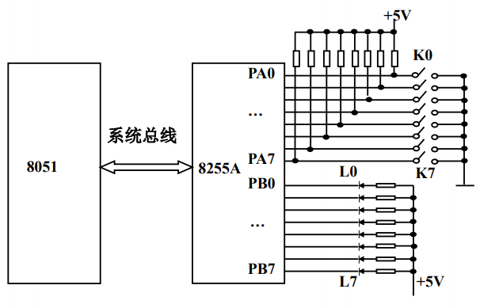
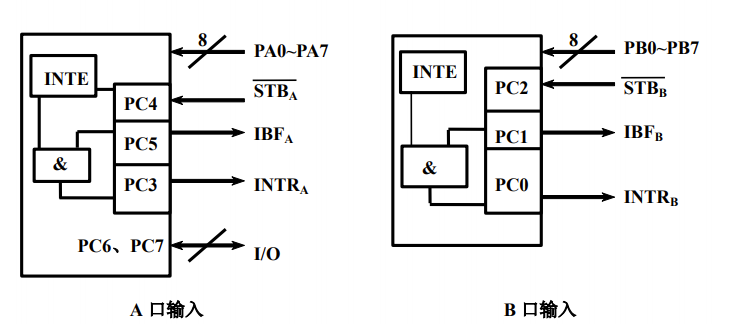

# 单片机外部总线扩展并口芯片8255A

## 8255A的结构与功能

- 8255A是一款可编程并行IO口扩展芯片，通过单片机总线连接，可使单片机扩展出3个8位并行IO口。
- 扩展的并行IO口具有多种工作模式，可实现方向控制、询问、应答控制等多种功能，可用于单片机对各种不同速度要求的外部设备的IO口控制。


- 3个可编程的并行I/O端口：PA口、PB口和PC口。

| $\overline{CS}$ |  A1  |  A0  | $\overline{RD}$ | $\overline{WR}$ |            I/O操作             |
| :-------------: | :--: | :--: | :-------------: | :-------------: | :----------------------------: |
|        0        |  0   |  0   |        0        |        1        |   读A口寄存器内容到数据总线    |
|        0        |  0   |  1   |        0        |        1        |   读B口寄存器内容到数据总线    |
|        0        |  1   |  0   |        0        |        1        |   读C口寄存器内容到数据总线    |
|        0        |  0   |  0   |        1        |        0        |  数据总线上内容写到A口寄存器   |
|        0        |  0   |  1   |        1        |        0        |  数据总线上内容写到B口寄存器   |
|        0        |  1   |  0   |        1        |        0        |  数据总线上内容写到C口寄存器   |
|        0        |  1   |  1   |        1        |        0        | 数据总线上内容写到控制口寄存器 |

## 8255A的引脚信号


- D7\~D0：三态双向数据线，与单片机的数据总线相连。
- $\overline{CS}$：片选信号线，低电平有效，用于选中8255A芯片。
- $\overline{RD}$：读信号线，低电平有效，用于控制从8255A端口读出信息。
- $\overline{WR}$：写信号线，低电平有效，用于控制从8255A端口写入信息。
- A1、A0：地址线，用来选择8255A的内部端口。
- PA7\~PA0，PB7\~PB0，PC7\~PC0：A、B、C口的8根I/O信号线，用于与外部设备连接。
- RESET：复位信号线。
- $V_{cc}$：+5V电源线。
- GND：地信号线。

## 8255A的控制字

> 8255A有两个控制字：**工作方式控制字**和**C口按位置位/复位控制字**。

### 工作方式控制字


### C口按位置位/复位控制字


## 8255A的工作方式

### 方式0——基本输入/输出方式



- 具有两个8位端口（A、B）和两个4位端口（C口的高4位和C库的低4位）。
- 任何一个端口都可以设定为输入或者输出。
- 每一个端口输出时锁存，而输入时不锁存。

### 方式1——选通输入/输出方式

> A口和B口作为数据I/O口，C口作为I/O的应答信号。

#### 方式1输入（单项并行口读入数据通信，带查询/应答机制）



- $\overline{STB}$：外设送给8255A的“输入选通”信号。
- $\overline{IBF}$：8255A送给外设的“输入缓冲器满”信号。
- INTR：8255A送给CPU的“中断请求”信号。
- INTE：8255A内部为控制中断而设置的“中断允许”信号。

#### 方式1输出（单项并行口输出数据通信，带查询/应答机制）


- $\overline{OBF}$：8255A送给外设的“输出缓冲器满”信号。
- $\overline{ACK}$：外设送给8255A的“应答”信号。
- INTR：8255A送给CPU的“中断请求”信号。
- INTE：8255A内部为控制中断而设置的“中断允许”信号。

### 方式2——双向传输方式

> 只有A口可以工作于方式2。


## 8255A与MCS-51单片机的接口

### 硬件接口

> 8255A的A口、B口、C口和控制口的地址分别是7F00H、7F01H、7F02H和7F03H（高8位地址线未用的取1，低8位地址线未用的取0）.


### 软件编程

[例] A口接开关K0\~K7，B口接发光二极管L0\~L7，要求从A口读入开关状态通过B口显示出来。8255A的工作方式控制字为1000 0010B(82H)。

[参考源码]

```c
#include <reg51.h>
#include <absacc.h>
#define uchar (unsigned char)
void main(void)
{
    uchar i;
    XBYTE[0x7f03] = 0x82; // 8255A初始化，B口方式0输入，A口方式0输出
    while(1)
    {
        i = XBYTE[0x7f01]; // 从B口输入
        XBYTE[0x7f00] = i; // 从A口输出
    }
}
```