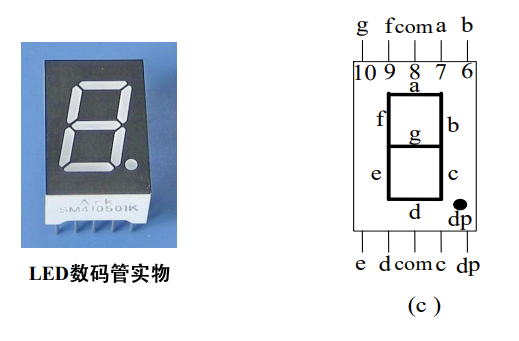
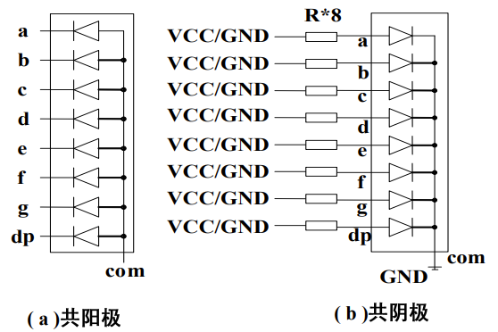
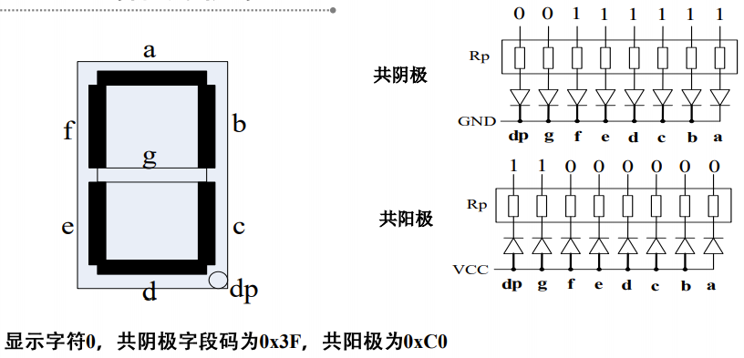
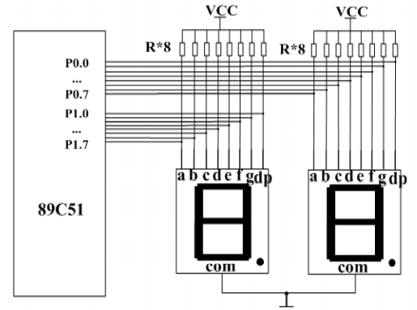
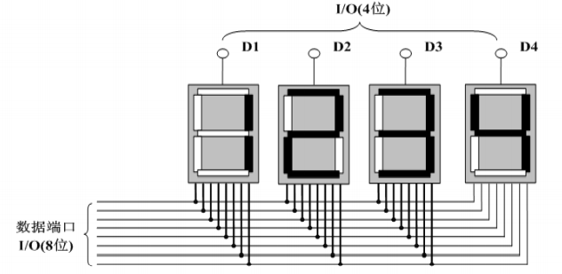

# LED数码管的工作原理及驱动方法

## LED显示器的结构与原理

在单片机应用系统中通常使用的是7段式LED数码管显示器，如图所示。

### LED数码管的内部结构

> 7段式LED数码管显示器，它有共阴极和共阳极两种。

### LED数码管的字段码

### LED数码管字型码表

| 显示字符 | 共阴极字段码 | 共阳极字段码 | 显示字符 | 共阴极字段码 | 共阳极字段码 |
| :------: | :----------: | :----------: | :------: | :----------: | :----------: |
|    0     | 3FH | C0H | A | 77H | 88H |
|    1     | 06H | F9H | B | 7CH | 83H |
|    2     | 5BH | A4H | C | 39H | C6H |
|    3     | 4FH | B0H | D | 5EH | A1H |
|    4     | 66H | 99H | E | 79H | 86H |
|    5     | 6DH | 92H | F | 71H | 8EH |
|    6     | 7DH | 82H | P | 73H | 8CH |
|    7     | 07H | F8H | U | 3EH | C1H |
|    8     | 7FH | 80H | T | 31H | CEH |
|    9     | 6FH | 90H | Y | 6EH | 91H |
| 8.(全亮) | FFH | 00H | L | 38H | C7H |

## LED数码管显示器的译码方式

### 硬件译码

硬件译码方式是指利用专门的硬件电路来实现显示字符到字段码的转换，如
MOTOTOLA公司生产的MC14495芯片。MC14495是共阴极一位十六进制数-字段码转换芯片，能够输出用四位二进制表示形式的一位十六进制数的七位字段码，不带小数点。

### 软件译码

不使用专用的译码/驱动器件，驱动功率较小，字形灵活，但软件编程较复杂。

## LED数码管的显示方式

### 静态显示

数码管公共端接固定电平，各笔画段位与I/O引脚相连，程序直接控制I/O口显示字符。

### 动态显示

将多个数码管的每一位笔划段并接在一起，用八个I/O口控制，公共端通过不同的I/O口线控制。工作时，逐位选中数码管并显示各自字符，循环点亮，利用人眼的**暂态效应**，达到显示效果。

