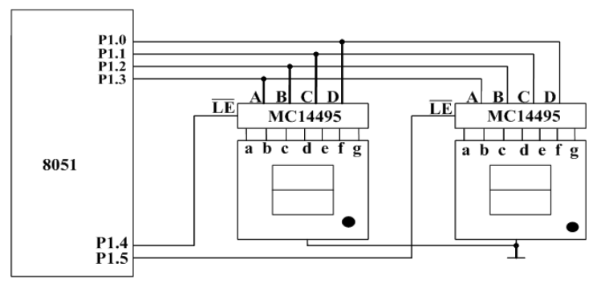
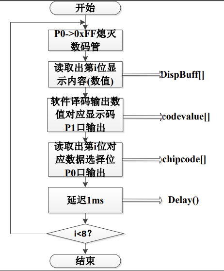
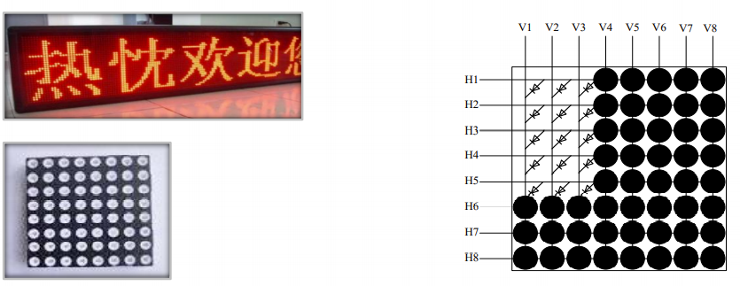
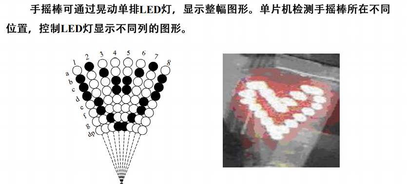
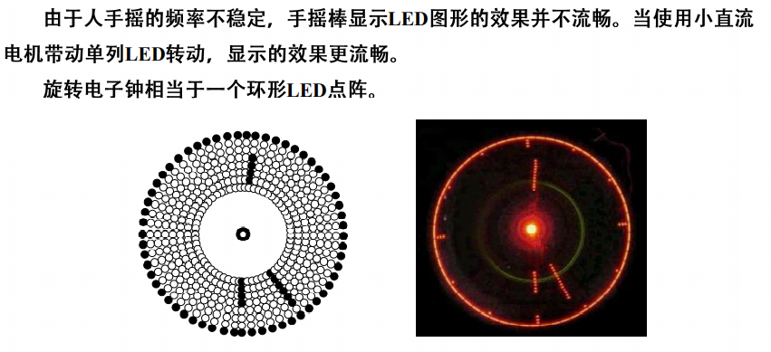

# LED数码管与单片机的接口

## 硬件译码静态显示

> 在实际应用时，如果数码管个数较少，通常用硬件译码静态显示，在数码管个数较多时，则通常用软件译码动态显示。



## 软件译码动态显示

下图是一个8位软件译码动态显示的接口电路图。P1口输出数据信号，P0口输出位选信号。数码管为共阴极，低电平选中。


### 流程图



### 示例源码

```c
#include <reg51.h>
#define uchar (unsigned char)
#define uint (unsigned int)

uchar disBuffer[8] = {0,1,2,3,4,5,6,7}; // 显示缓冲区
uchar codeValue[16] = {
    0x3f, 0x06, 0x5b, 0x4f,
    0x66, 0x6d, 0x7d, 0x07,
    0x7f, 0x6f, 0x77, 0x7c,
    0x39, 0x5e, 0x79, 0x71
}; // 0~F的字段码表
uchar chipCode[8] = {0xfe,0xfd,0xfb,0xf7,0xef,0xdf,0xbf,0x7f}; // 位选码表

void main(void)
{
    while(1) display(); 
}

void display() // 显示函数
{
    uchar i, p, temp;
    for(i = 0; i < 8; i++)
    {
        P0 = 0xFF;
        p = disBuffer[i]; // 取当前显示的字符
        temp = codeValue[p]; // 取出显示数字对应字段码
        P1 = temp; // 送出字段码
        P0 = chipCode[i]; // 送出位选码
        delay(20); //延时
    }
}

void delay(unit i) // 延时函数
{
    for( ; i > 0; i--);
}
```


## LED动态显示计数的扩展应用

### LED点阵



### LED手摇棒



### LED旋转电子钟



### 车轮上的LED彩色旋转显示屏


