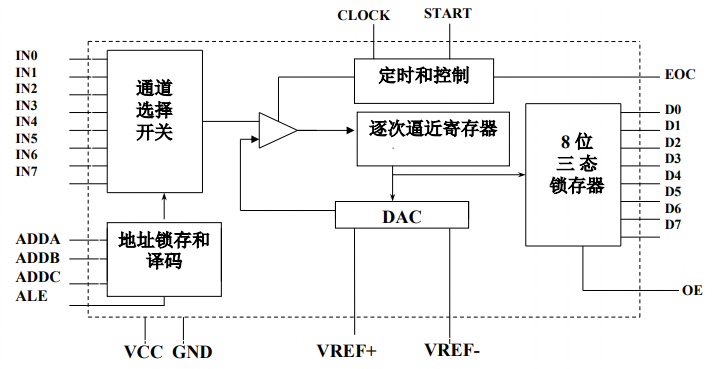
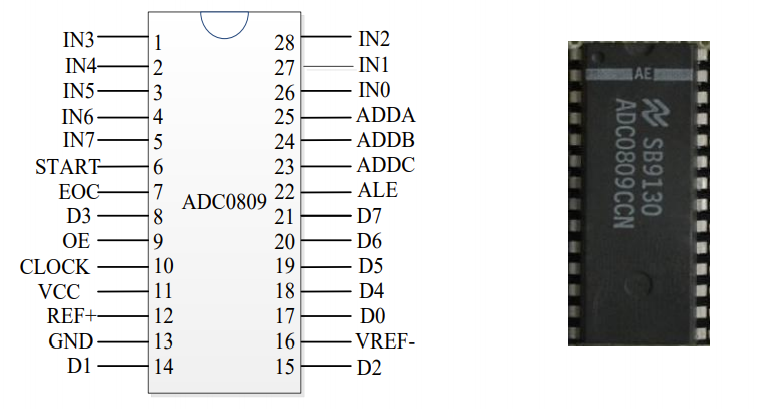
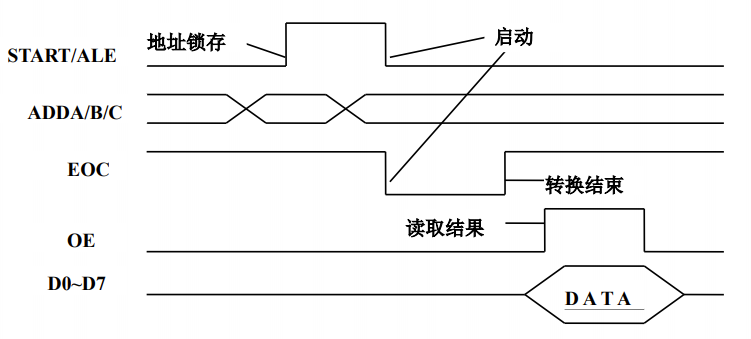
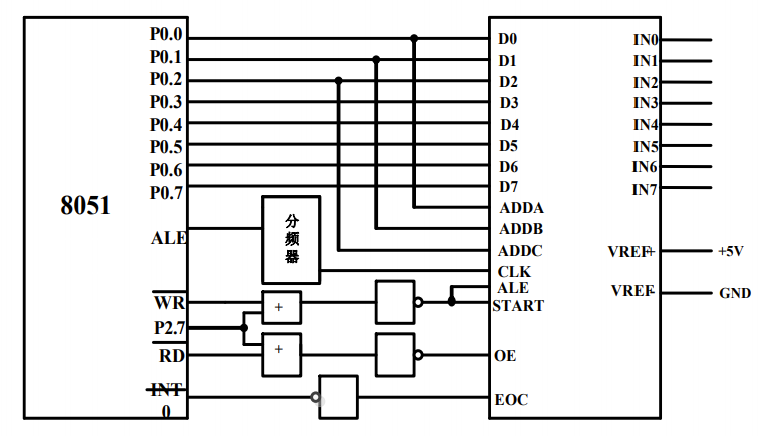

# ADC0809与单片机的控制接口

## ADC0809逐次逼近型转换器

ADC0809是CMOS工艺单片型逐次逼近型A/D转换器，具有8路模拟量输入通道，有转换起停控制，模拟输入电压范围为0\~+5V，转换时间为100 μs。

 

## ADC0809的引脚

ADC0809芯片有28个引脚，采用双列直插式封装（DIP28）。



其中：

- IN0\~IN7：8路模拟量输入端。

- D0\~D7：8位数字量输出端。

- ADDA、ADDB、ADDC：3位地址输入线，用于选择8路模拟通道中的一路。
  | ADDC | ADDB | ADDA | 选择通道 |
  | :--: | :--: | :--: | :------: |
  |  0   |  0   |  0   |   IN0    |
  |  0   |  0   |  1   |   IN1    |
  |  0   |  1   |  0   |   IN2    |
  |  0   |  1   |  1   |   IN3    |
  |  1   |  0   |  0   |   IN4    |
  |  1   |  0   |  1   |   IN5    |
  |  1   |  1   |  0   |   IN6    |
  |  1   |  1   |  1   |   IN7    |

- ALE：地址锁存允许信号，输入，由低电平变高电平锁存。

- START：A/D转换启动信号，输入，由高电平变低电平启动。

- EOC：A/D转换结束信号，输出。当启动转换时，该引脚为低电平，当A/D转换结束时，该引脚输出高电平。

- OE：数据输出允许信号，输入，高电平有效。当转换结束后，如果从该引脚输入高电平，则打开输出三态门，输出锁存器的数据从D0\~D7送出。

- CLK：时钟脉冲输入端。要求时钟频率不高于640kHz。

- REF+、REF-：基准电压输入端。

- VCC：电源，接+5V电源。

- GND：接地。

## ADC0809的工作流程



1. 输入3位地址，并使ALE=1，将地址存入地址锁存器中，经地址译码器译码从8路模拟通道中宣统一路模拟量送到比较器。
2. 送START一高脉冲，START的上升沿使逐次逼近寄存器复位，下降沿启动A/D，并使EOC信号为低电平。
3. 当转换结束时，转换的结果送入三态锁存器，并使EOC信号回到高电平，通知CPU已转换结束。
4. 当CPU执行一读数据指令，时OE为高电平，则从输出端D0\~D1读出数据。

## ADC0809与MCS-51单片机的接口

下图是一个ADC0809与8051的一个接口电路图。



向地址满足A15=0的端口进行写操作时，即可产生ALE/START信号所需的上升沿，写操作结束后，即可产生下降沿。

向地址满足A15=0的端口进行读操作时，即可产生OE信号所需的上升沿。

启动AD转换时EOC为低电平，转换结束时变为高电平，其电平极性与INT0中断相反，即需要通过反相器将极性反向。

## 软件编程

设系统为一个8路模拟量输入的巡回检测系统，使用中断方式采样数据，把采样转换所得的数字量按序存于片内RAM中。采样完一遍后停止采集。

参考源码如下：

```c
#include <reg51.h>
#include <absacc.h>
#define uchar (unsigned char)

uchar data x[8]; // 定义8个单元的数组，存放结果
uchar xdata *ADadr; // 定义指向通道的指针
uchar i = 0;
void main(void)
{
    IT0 = 1; // 初始化
    EX0 = 1;
    EA = 1;
    i = 0;
    ADadr = 0x7FF8; // 指针指向通道0
    *ADadr = i; // 启动通道0转换
    for(;;) {;} // 等待中断
}

void int_adc(void) interrupt 0 // 中断函数
{
    x[i] = *ADadr; // 接收当前通道转换的结果
    i++;
    ADadr++; // 指向下一个通道
    if(i < 8) *ADadr = i; // 8个通道未转换完，启动下一个通道返回
    else
    {
        EA = 0;
        EX0 = 0; // 8个通道转换完，关中断返回
    }
}
```