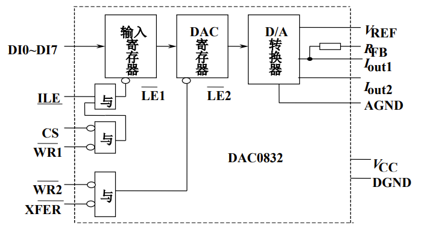
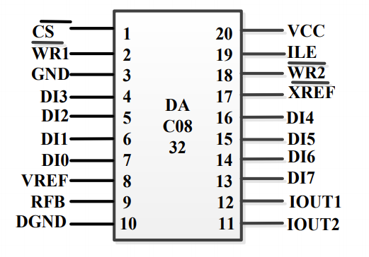
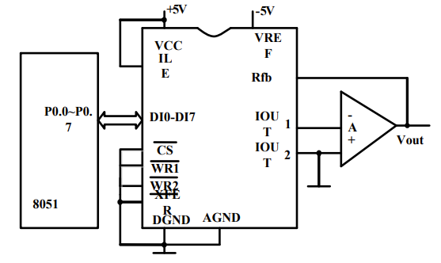
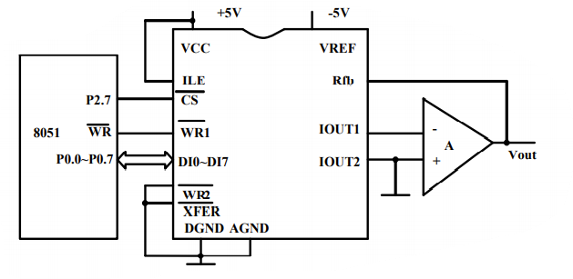
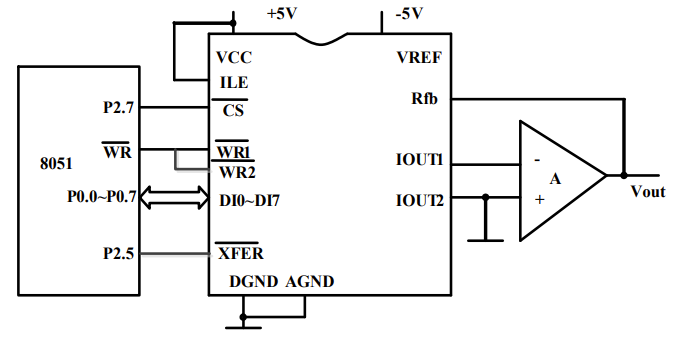
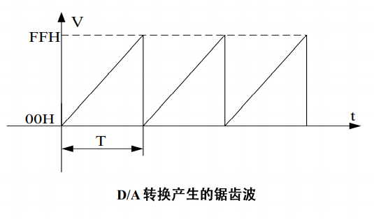

# DAC0832与单片机的接口

## DAC0832的结构

DAC0832是美国半导体公司（NS）设计的一款8位T型电阻网络D/转换器，并行数字量输入，电流输出型，建立时间为1μs。

DAC0832与单片机的接口简单，易于控制，价格便宜且精度适中，在实际应用系统中被广泛使用。



## DAC0832的引脚

> DAC0832有20个引脚，采用双列直插式封装。



- DI0\~DI7：8位数字量输入端。
- ILE：数据允许控制输入线。
- $\overline{CS}$：片选信号。
- $\overline{WR1},\overline{WR2}$：写信号线1，2.
- $\overline{XFER}$：数据传送控制信号输入线。
- IOUT1, IOUT2：模拟电流输出线1，2.
- $R_{fb}$：片内反馈电阻引出线，用作外接的运放的反馈电阻。
- $V_{REF}$：基准电压输入线。电压范围-10V\~10V。
- VCC：工作电源输入端，可接+5V\~+15V。
- AGND：模拟地。
- DGND：数字地。

## DAC0832的工作方式

>通过改变控制端ILE，WR1，WR2，CS和XREF的连接方式，DAC0832可以实现：直通方式，单缓冲方式，双缓冲方式三种工作方式，满足不同的应用要求。

### 直通方式

WR1、WR2、CS、XREF接地，ILE接VCC。



8位输入寄存器和8位DAC寄存器都直接处于导通状态，8位数字量到达DI0\~DI7,立即进行D/A转换，输出端得到转换的模拟量。由于单片机数据总线的分时复用特性，此方式下单片机数据总线不能与DI0\~DI7直接连接，只能通过单片机独立IO并行口(或直接数字芯片输出)与DAC0832连接。

### 单缓冲方式

通过引脚WR1、WR2、CS、XREF使得两个锁存器的一个处于直通状态，另一个处于受控制状态，或者两个被控制同时导通。此方式下，单片机的数据总线可以与DAC832直接连接，CPU向DAC0832输入一次数据后，DAC就能输出模拟信号，是最常用的一种接口形式。



### 双缓冲方式

引脚WR1、WR2、CS、XREF使得两个锁存器的一个处于直通状态，另一个处于受控制状态，或者两个被控制同时导通，DAC0832就工作于双缓冲方式。一般在单片机同时控制多片DAC0832工作时采用。



## DAC0832的应用举例

D/A转换器在实际中经常作为波形发生器使用，通过它可以产生各种各样的波形。
基本原理是：利用D/A转换器输出模拟量与输入数字量成正比这一特点，通过程序控制CPU向D/A转换器送出随时间呈一定规律变化的数字，则D/A转换器输出端就可以输出随时间按一定规律变化的波形。



**[示例源码]**

```c
#include <absacc.h>
#define uchar (usigned char)
#define DAC0832 XBYTE[0x7FFF]

void main(void)
{
    uchar i;
    while(1)
    {
        for(i = 0; i < 0xff; i++) DAC0832 = i;
    }
}
```