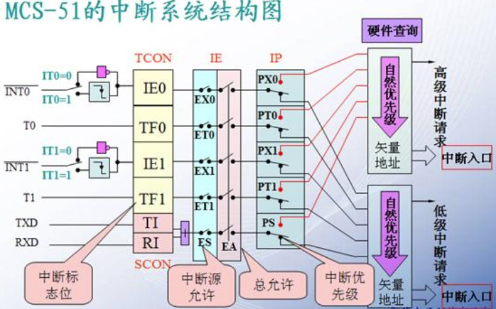

# 单片机C51中断函数

## 函数

函数是C语言的基本模块，C51与标准C语言类似，支持关于C语言的基本语法。同时也针对单片机特有的属性，增加了一些与函数相关的关键字和语法，并对一些库函数的处理做了调整。具体为：

- 增加了中断函数的语法
- 对stdio.h中标准输入输出库函数进行了调整

## 中断函数

> 中断函数是单片机的一个重要特性，要使用C51语言开发单片机程序，必须支持中断函数的定义。

### 中断相关概念

**中断是CPU对系统发生的某个事件作出的一种反应。** 引起中断的事件称为中断源。中断源向CPU提出处理的请求称为中断请求。发生中断时被打断程序的暂停点称为断点。CPU暂停现行程序而转为响应中断请求的过程称为中断响应。处理中断源的程序称为中断处理程序。CPU执行有关的中断处理程序称为中断处理。而返回断点的过程称为中断返回。

### 中断函数

**中断函数是硬件或者操作系统自动调用的，也就是说只要满足触发条件，就会自动调用中断函数（此时主函数是停止的）。** 当中断函数执行完毕，又返回主函数继续执行主函数。

### 定义一个中断函数

#### interrupt m 修饰符

interrupt m 是C51中定义某个函数为中断响应函数的修饰符，当函数定义时后面用了interrupt m，系统编译时把该函数转化为某个中断员的响应函数，并把函数地址存放在存储器的中断对应的位置。

interrupt m 修饰符中，m的取值为0/1/2/3/4/5，对应的中断情况如下：

| 中断源                             | 入口地址 |
| :--------------------------------- | -------- |
| 0：外部中断0                       | 0003H    |
| 1：定时/计数器T0                   | 000BH    |
| 2：外部中断1                       | 0013H    |
| 3：定时/计数器T1                   | 001BH    |
| 4：串行口                          | 0023H    |
| 5：定时/计数器T2*（仅52子系列有）* | 002BH    |

### 注意事项

- 中断函数不能进行参数传递，不能有返回值。
- 中断函数不能被其他函数直接调用。因为中断函数的返回是由RETI指令完成的，而普通函数的返回指令是RET。
- 如果在中断函数中调用了其他函数，则被调用的函数所使用的寄存器必须与中断函数的相同。

