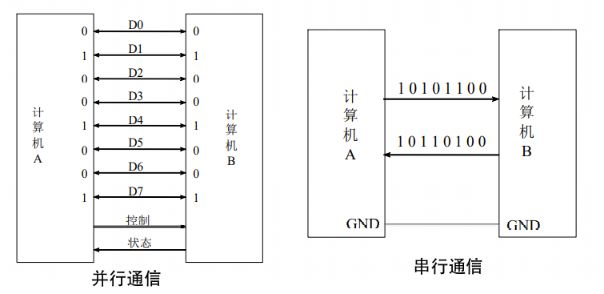
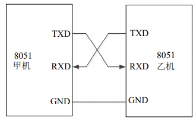

# 单片机串行通讯的概念和工作原理

## 通讯的基本概念

> 根据信息传送的方向，通信分为：单工、半双工和全双工三种。

## 并行通信和串行通信

## 同步通信和异步通信

**串行通讯**按信息的格式可分为：

- 串行异步通信：根据通信双方各自的时钟基准，按照约定好的速率传输串行数据。
- 串行同步通信：通信双方以同一个时钟信号为基准，根据时钟信号传输串行数据。

## 串行通信电平标准及硬件接口协议

MCS-51单片机是标准数字电路芯片，其输入输出引脚电平符合TTL电平规则(高电平逻辑3-5V，低电平逻辑0-1V)。该电平标准有效传输距离较短(15米以内)。不适于远距离通信信号传输。为了提高串行通信可靠性，增大通信距离，人们定义了各种新的通信电平标准。后经美国电子工业协会(EIA)指定标准规范化，形成RS422，RS232，RS485三种异步串行通信电平标准和硬件接口协议。

RS232接口标准是一种用于短距离或带调制解调器(Modem)的串行通信接口标准，1970年由美国电子工业协会(EIA)联合贝尔系统、调制解调器厂家及计算机终端生产厂家共同制定的。

