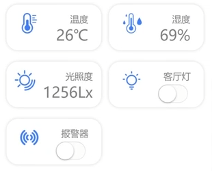

# Body数据区样式编写

## 参考图



## 参考源码

> 注：数据不代表真实情况。

```html
<template>
	<div class="wrapper">
		<div class="header-wrapper"> </div>
			<div class="header-title">
				<span>空气质量-良好</span>
				<span>南宁市</span>
			</div>
			<div class="header-text">
				<span>55</span>
				<span>阴</span>
			</div>
			<div class="weather-advice">空气质量良好，健康人群外出活动无需刻意防护</div>
		<div class="body-wrapper">
			<div class="body">
				<div class="data-wrapper">
					<div class="data">
						
						<div class="data-text">
							<div class="data-title">温度</div>
							<div class="data-value">26℃</div>
						</div>
					</div>
					<div class="data">
						
						<div class="data-text">
							<div class="data-title">湿度</div>
							<div class="data-value">69％</div>
						</div>
					</div>
					<div class="data">
						
						<div class="data-text">
							<div class="data-title">光照度</div>
							<div class="data-value">1256Lx</div>
						</div>
					</div>
					<div class="data">
						
						<div class="data-text">
							<div class="data-title">客厅灯</div>
							<div class="data-value">
								<switch color="#3d7ef9" />
							</div>
						</div>
					</div>
					<div class="data">
						
						<div class="data-text">
							<div class="data-title">报警器</div>
							<div class="data-value">
								<switch color="#3d7ef9" />
							</div>
						</div>
					</div>
				</div>
			</div>
		</div>
	</div>
</template>
```

```scss
<style lang="scss" scoped>
.wrapper {
    padding: 15px;
    .header-wrapper {
        background-color: #3d7ef9;
        border-radius: 20px;
        color: #fff;
        box-shadow: #d6d6d6 0 0 5px;
        padding: 15px 30px;
        .header-title {
            display: flex;
            justify-content: space-between;
        }
        .header-text {
            font-size: 32px;
            font-weight: 400;
            display: flex;
            justify-content: space-between;
        }
        .weather-advice {
            margin-top: 20px;
            font-size: 12px;
        }
    }
    .data-wrapper {
        margin-top: 20px;
        display: flex;
        justify-content: space-between;
        .data {
            background-color: #fff;
            width: 150px;
            height: 80px;
            border-radius: 20px;
            display: flex;
            justify-content: space-around;
            padding: 0 8px;
            box-shadow: #d6d6d6 0 0 5px;
            .data-logo {
                height: 36px;
                width: 36px;
                margin-top: 15px
            }
            .data-text {
                margin-top: 15px;
                color: #7f7f7f;
                .data-value {
                    font-size: 26px;
                }
            }
        }
    }
}
</style>
```
