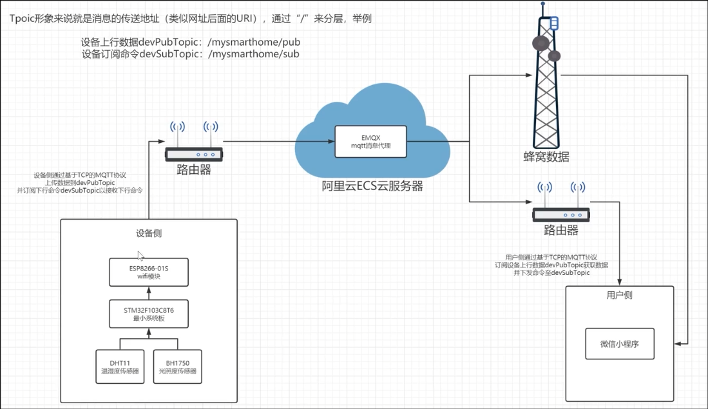

# 总体思路&硬件选型

## 整体结构

## 硬件清单

### 核心板

#### STM32F103C8T6

### WIFI模块

#### ESP8266-01s

### 传感器

#### DHT11温湿度传感器

#### BH1750光照传感器

### 其他

#### LED

#### OLED

#### 4脚按键开关

#### CP2102（USB转TTL模块）

#### 有源蜂鸣器（低电平触发）

#### 金属膜电阻器

#### 面包板（或PCB）

#### 电源和导线

## 采购记录

|     项目      | 数量 |已购 | 价格 |
| :-----------: | :--: |:--: | :--: |
| STM32F103C8T6 | 1 |  |      |
|  ESP8266-01s  | 1 |   |      |
|  DHT11温湿度传感器  | 1 |      |      |
|  BH1750光照传感器  | 1 |     |      |
|      LED      |      |  |      |
|     OLED      | 1 | |      |
|     4脚按键开关  |   | |      |
|    CP2102     | 1 |  |     |
|  有源蜂鸣器   |      |    |  |
| 金属膜电阻器  |      |     | |
|  面包板/PCB   |      |  | |
|  电源和导线   |      |    |  |
|  **合计**   |      |    |  |