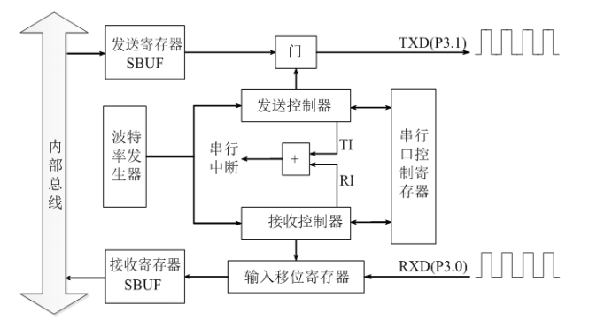
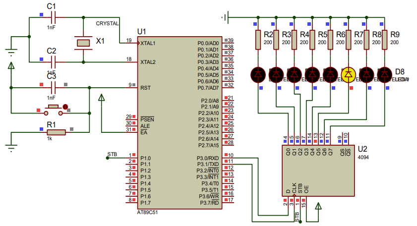
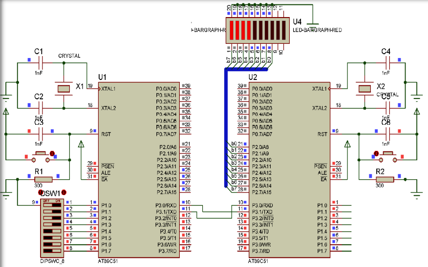

# 单片机的串行口工作方式及应用

## 串行口的结构

> MCS-51单片机串行口主要由发送数据寄存器、发送控制器、输出控制门、接收数据寄存器、接受控制器、输入移位寄存器等组成。



### 串行口控制寄存器SCON

| SCON | D7   | D6   | D5   | D4   | D3   | D2   | D1   | D0   |
| ---- | ---- | ---- | ---- | ---- | ---- | ---- | ---- | ---- |
| 98H | SM0 | SM1 | SM2 | REN | TB8 | RB8 | TI |RI|

- SM0、SM1：串行口工作方式选择位

  | SM0  | SM1  | 方式  | 功能            | 波特率                       |
  | ---- | ---- | ----- | --------------- | ---------------------------- |
  | 0    | 0    | 方式0 | 移位寄存器方式  | $f_{osc}/12$                 |
  | 0    | 1    | 方式1 | 8位异步通信方式 | 可变                         |
  | 1    | 0    | 方式2 | 9位异步通信方式 | $f_{osc}/32$ 或 $f_{osc}/64$ |
  | 1    | 1    | 方式3 | 9位异步通信方式 | 可变                         |

- SM2：多机通信控制位
- REN：允许接收控制位
- TB8：发送的第9位数据
- RB8：接受的第9位数据
- TI：发送中断标志位
- RI：接收中断标志位

### 电源控制寄存器PCON

| PCON | D7   | D6   | D5   | D4   | D3   | D2   | D1   | D0   |
| ---- | ---- | ---- | ---- | ---- | ---- | ---- | ---- | ---- |
| 87H  | SMOD |      |      |      |      |      |      |      |

当SMOD位为1时，串行口方式1、方式2、方式3的波特率加倍。

## 串行口的工作方式

### 方式0

> 方式0通常用来外接移位寄存器，用作扩展I/O口。方式0工作时波特率固定为： $f_{osc}/12$。工作时，串行数据通过RXD输入和输出，同步时钟通过TXD输出。

#### 发送过程

在TI=0时，当CPU执行一条向SBUF写数据的指令时，启动发送过程。从RXD依次发送出去，同步时钟从TXD送出。8位数据发送完后，发送中断标志TI置位，并向CPU申请中断。

#### 接收过程

在RI=0的条件下，将REN置“1”就启动一次接收过程。在移位脉冲的控制下，RXD上的串行数据依次移入移位寄存器。当8位数据全部移入移位寄存器后，8位数据送入接收数据缓冲器SBUF中，同时，接收中断标志RI置位，向CPU申请中断。

#### 利用方式0扩展并行I/O口

MCS-51单片机的串行口在方式0时，当外接一个串入并出的移位寄存器，就可以扩展并行输出口，当外接一个并入串出的移位寄存器时，就可以扩展并行输入口。

##### [例] 用8051单片机的串行口外接串入并出芯片CD4094扩展并行输出口控制一组发光二极管，从左至右延时轮流显示。



> 4094 是一块8位的串入并出的芯片，共16个引脚：
>
> - D：串行数据输入端
> - CLK：串行时钟信号输入端
> - Q0\~Q7：8位数据并行输出端
> - STB：锁存端
> - OE：数据输出允许端
>
> 4094的工作过程一般如下：
>
> 1. 使锁存STB=0，在串行时钟信号CLK的作用下，数据从输入端D按一个时钟周期一位依次串行输入。
> 2. 8位数据输入后，使控制端STB=1，输入的内容锁存到内部锁存器。
> 3. 使数据输出允许端OE=1，锁存的数据送Q0\~Q7行输出。

[参考源码]

```c
#include <reg51.h>
void main()
{
    unsigned char i;
    unsigned int j;
    SCON = 0x00; // 串口初始化方式0
    i = 0x01;
    for( ; ; )
    {
        P1_0 = 0; // 4049串入
        SBUF = i; // 51单片机串口发送
        while(!TI){ ;} // 等待发送
        P1_0 = 1; TI = 0; // 4049并出显示
        for(j = 0; j <= 254; j++){ ;} // 延时
        i *= 2;
        if(i == 0x00) i = 0x01;
    }
}
```


### 方式1

> 方式1为8位异步通信方式，在方式1下，一帧信息为10位：1位起始位(0)，8位数据位(低位在前)和1位停止位(1)。

#### 发送过程

在TI=0时，向SBUF写数据，启动发送过程。数据由TXD引脚送出，在发送时钟的作用下，先通过TXD端送出数据，当一帧数据发送完毕后，由硬件使发送中断标志TI置位。

#### 接收过程

当允许接收控制位REN被置1，启动接收控制器开始接收数据。在接收移位脉冲的控制下依次把所接收的数据移入移位寄存器，当8位数据及停止位全部移入后，进行响应操作。

## 串行口的编程及应用

#### [例] 设计双机通信系统。

> <font color=#88aa99>**要求：甲机P1口开关的状态通过串行口发送到乙机，乙机接收到后通过P2口的发光二极管显示。**</font>



[分析] 甲、乙两机都选择方式1：8位异步通信方式，波特率为1200bps，甲机发送，乙机接收，因此甲机的串口控制字为40H。乙机的串口控制字为50H。由于选择的是方式1，波特率由定时/计数器T1的溢出率和电源控制寄存器PCON中的SMOD位决定。则须对定时/计数器T1初始化。设SMOD=0，甲、乙两机的振荡频率为12MHZ，由于波特率为1200，定时/计数器T1选择为方式2，则初值为:

$初值\;=256-f_{osc}×2SMOD/(12×波特率×32)\\\qquad=256-12000000/(12×1200×32)\\\qquad\approx230\\\qquad=E6H$

跟据要求定时/计数器T1的方式控制字为20H。

[参考源码]

- 甲机发送方程序

```c
#include <reg51.h>
void main()
{
    unsigned char i;
    SCON = 0x40;
    TMOD = 0x20;
    TL1 = 0xE6;
    TH1 = 0xE6;
    TR1 = 1;
    P1 = 0xFF;
    while(1) // 发送
    {
        i = P1;
        SBUF =i;
        while(TI == 0);
        TI = 0;
    }
}
```


- 乙机接收方程序

```c
#include <reg51.h>
void main()
{
    unsigned char i;
    SCON = 0x50;
    TMOD = 0x20;
    TL1 = 0xE6;
    TH1 = 0xE6;
    TR1 = 1;
    EA = 1;
    ES = 1;
    while(1) { ;} // 发送
}
void funins(void) interrupt 4 // 接收
{
    if(RI)
    {
        RI = 0;
        P2 = SBUF;
    }
}
```