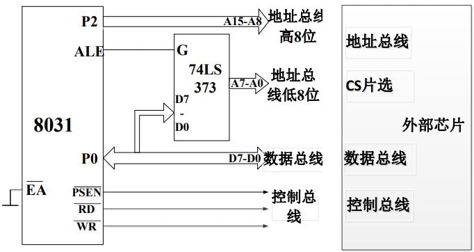
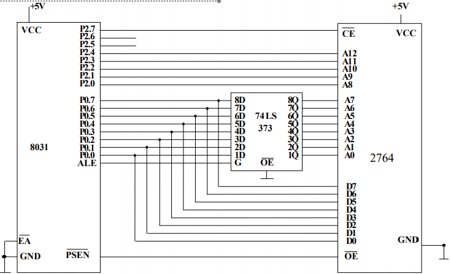

# 单片机片外总线扩展存储器

## 单片机外部总线扩展的基本上思路

## MCS-51单片机的存储器扩展

### 存储器扩展的能力

> 片外程序存储器可扩展64kB，地址：0000H\~FFFFH

### 存储器扩展的一般方法

> 不论何种存储器芯片，其引脚都呈三总线结构，与单片机连接都是三总线连接。

#### 控制线

- 程序存储器：ROM芯片输出允许控制线OE与单片机的PSEN信号线相连。
- 数据存储器：RAM芯片输出允许控制线OE和写控制线WE分别与单片机的读信号线RD和写信号线WR相连。

#### 数据线

存储器芯片的数据线与单片机的数据总线。（P0.0\~P0.7）按由低位到高位的顺序相接。

#### 地址线

存储器芯片的地址线的数目由芯片的容量决定。容量Q与地址线数目N满足关系式：$Q=2^N$。

#### 芯片选择引脚

每一个连接在公共总线上的芯片都有片选输入引脚（CS，一般为低电平有效），用于供CPU选择某个时刻使能该芯片被选中，占用总线。而当片选引脚电平无效时，芯片不被选中，芯片与总线连接引脚呈高阻隔离状态。

## 程序存储器扩展

### 单片程序存储器的扩展

- A15直接连接CS端

### 多片程序存储器的扩展

