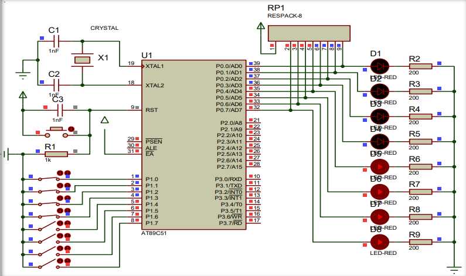

# 单片机并行I/O口的使用

> MCS-51单片机的内部资源主要有并行I/O口、定时器/计数器、串行接口以及中断系统。MCS-51单片机的大部分功能就是通过对这些资源的利用来实现的。
>
> - 并行I/O口实现8位数字量的输入输出；
> - 定时器/计数器实现周期性动作或对外部事件计数；
> - 串行接口实现单片机与其他设备的数据通信；
> - 中断系统实现对外部事件的及时响应。

## 并行输入/输出接口

MCS-51单片机有4个8位的并行输入/输出接口：P0、P1、P2和P3口。这4个口既可以并行输入或输出8位数据，又可以按位方式使用，即每一位均能独立作为输入或输出接口用。用C51语言编程时，对端口输出时，端口号在等号左端，读入时，端口号在等号右端。

例如：

```c
P0 = 0x80; // 输出1000 0000电平到P0口
P1 = 0xFF; // 读入P1电平前，先输出高电平
i = P1; // 读入P1电平保存到变量i
```


