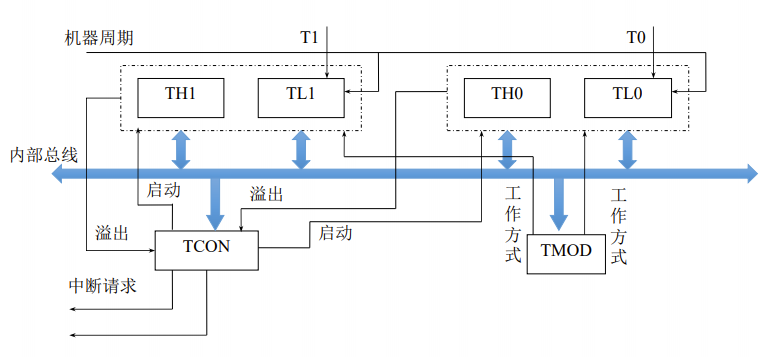
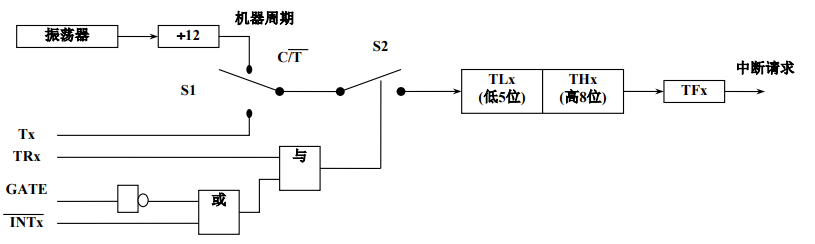

# 定时器/计数器的工作原理及工作方式

## 定时/计数器的主要特性

- 51系列中51子系列有两个16位的可编程定时/计数器：T0和T1；52子系列除了T0，T1，还多一个T2。
- 每个模块既可以对系统时钟计数（定时器），也可以对外部信号计数（计数器），通过编程设定来实现。
- 每个定时/计数器都有多种各种方式，不同的各种方式对应计数长度和初值装载方式不同。

## 定时/计数器T0、T1的结构

### 注意要点

- 由于它是加法计数器，每来一个计数脉冲，加法器内容加1，当由全1加到全0时溢出，如果要计N个单位，则首先应向计数器置初始值为X：`初始值X = 最大计数值（满值）M - 计数值N;`  在不同的计数方式下，满值不一样，一般来说，当定时器/计数器工作于R位计数方式时，它的满值为$2^R$。
- 当定时/计数器工作于计数方式时，对芯片引脚T0-P3.4（或T1-P3.5）上的输入脉冲计数。计数过程：在每一个机器周期的S5P2时刻对T0或T1上电平采样一次，当上一个机器周期采样到高电平，下一个机器周期采样到低电平，则计数器在下一个机器周期的S3P2时刻加1计数一次。

## 方式寄存器和控制寄存器

### 定时/计数器的方式寄存器TMOD

|  TMOD   |  D7  |  D6  |  D5  |  DD  |  D3  |  D2  |  D1  |  D0  |
| :-----: | :--: | :--: | :--: | :--: | :--: | :--: | :--: | :--: |
| （89H） |  GATE |  C/T | M1  |  M0  |  GATE |  C/T |  M1  |  M0  |
|         |  ←—— | 定时器1    | —— |  ——→  |  ←——  |定时器0|——|——→|

其中：M1、M0为工作方式选择位，用于对T0的四种工作方式，T1的三种工作方式进行选择，选择情况如下：

|  M1  |  M0  | 工作方式 |            方式说明              |
| :--: | :--: | :------: | :----------------------------: |
|  0   |  0   |    0     |        13位定时/计数器          |
|  0   |  1   |    1     |        16位定时/计数器          |
|  1   |  0   |    2     |     8位自动重置定时/计数器       |
|  1   |  1   |    3     | 两个8位定时/计数器（只有T0有）    |

C/T：定时或计数方式选择位，当C/T=1时工作于计数方式；当C/T=0时工作于定时方
式。
GATE：门控位，用于控制定时/计数器的启动是否受外部中断请求信号(INTO,INT1)的影响，INTx位高电平时才运行。

### 定时/计数器的控制寄存器TCON

| TCON |  D7  |  D6  |  D5  |  DD  |  D3  |  D2  |  D1  |  D0  |
| :--: | :--: | :--: | :--: | :--: | :--: | :--: | :--: | :--: |
| （88H） | TF1 | TR1 | TF0 | TR0 | IE1 | IT1 | IE0 | IT0 |

TF1(TF0)：定时/计数器T1(T0)的溢出标志位，当定时/计数器T1计满时，由硬件使它置位。TR1(TR0)：定时/计数器T1(T0)的启动位，当TR1=1时启动；TR1=0时停止。

## 定时/计数器的工作方式

### 方式0

方式0是13位的定时/计数方式，因而最大计数值(满值)为2的13次幂，等于8192。如计数值为N，则置入的初值X为∶`X = 8192 - N`。如定时/计数器T0的计数值为1000，则初值为7192，转换成二进制数为`1110000011000B(1C18H)`，则`THO = 11100000B(E0H); TLO = 00011000B(18H)` 。

### 方式1

方式1的结构与方式0结构相同，只是把13位变成16位，16位的加法计数器被全部用上。由于是16位的定时/计数方式，因而最大计数值(满值)为2的16次幂，等于65536如计数值为N，则置入的初值X为:`X = 65536 - N`。如定时/计数器T0的计数值为1000，则初值为65536-1000=64536，转换成二进制数为`1111110000011000B(FC18H)`，则`TH0 = 11111100B(FCH); TLO = 00011000B(18H)`。

### 方式2

方式2下，16位的计数器只用了8位来计数，用TL0(或TL1)来进行计数，而TH0(或TH1)用于保存初值。当TL0(或TL1)计满时则溢出，一方面使TF0(或TF1)置位，另一方面溢出信号又会触发开关，将TH0(或THI)的值自动装入TL0(或TL1)。

由于是8位的定时/计数方式，因而最大计数值(满值)为2的8次幂，等于256。如计数值为N,，则置入的初值X为：`X = 256 - N`。如定时/计数器T0的计数值为100，则初值为256-100=156，转换成二进制数为`10011100B(9CH)`，则`TH0 = TL0 = 10011100B`。

### 方式3

方式3只有定时/计数器T0才有，当M1M0两位为11时，定时/计数器T0工作于方式3。方式3下，定时/计数器T0被分为两个部分TL0和TH0，其中，TL0可作为定时/计数器使用，占用T0的全部控制位：GATE、C/T、TR0和TF0；而TH0固定只能作定时器使用，对机器周期进行计数，这时它占用定时/计数器T1的TR1位、TF1位和T1的中断资源。
