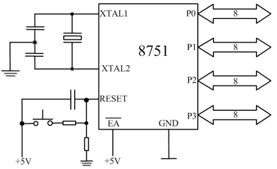
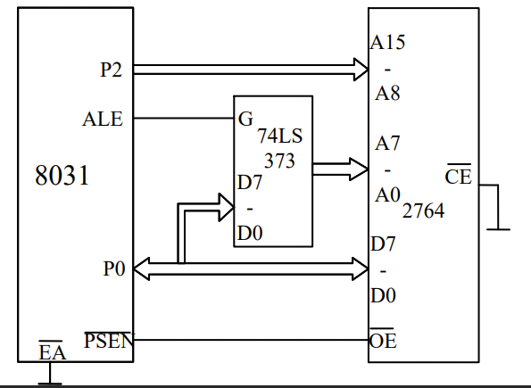

# MCS-51单片机的最小系统

## 最小系统

> 所谓最小系统，是指可独立工作的单片机，所需要的最小配置电路。MCS-51单片机根据片内有无程序存储器最小系统分两种情况。

### 8051/8751最小系统

8051/8071片内由4kB的ROM/EPROM，只需用外接晶体振荡器和复位电路就可构成最小系统。如图所示。

### 8031最小系统

8031片内无程序存储器篇，在构成最小应用系统时不仅要外接晶体振荡器和复位电路，还应外扩展程序存储器。

