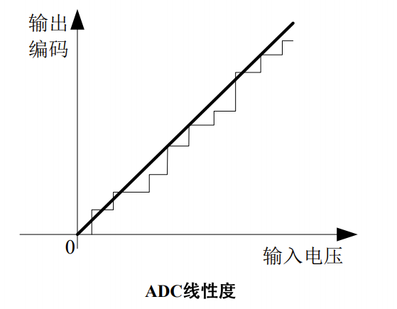

# ADC(Analog-to-Digital Converter)的工作原理

## A/D转换器概述

现实世界中，各自物理量（温度、压力、流量、速度等）通过传感器转换成电信号，通常都是模拟信号。而单片机作为数字电路芯片，只能处理数字电平信号。因此需要有器件实现模拟量到数字量之间的转换。AD器件是将模拟量转换为数字信号的芯片；DA器件则是将数字量转换为模拟信号的芯片。

## A/D转换器的类型及原理

> 各种A/D转换芯片根据转换原理可分为：
>
> 计数型A/D转换器、逐次比较式、双重积分型、并行式A/D转换器等；
>
> 按转换方法可分为：
>
> 直接A/D转换器、间接A/D转换器。
>
> 按分辨率可分为：
>
> 4、8、12、16位的A/D转换器芯片。

### 逐次逼近型A/D转换器

逐次逼近型A/D转换器是由一个比较器、D/A转换器、寄存器及控制电路组成部分组成。是用一系列已知的电压权值，从高位到低位依次开始逐位试探比较。

### 双重积分型A/D转换器

双重积分型ADC将输入电压先变换成与其平均值成正比的时间间隔，然后再把此时间间隔转换成数字量，它属于间接型转换器。

由于在转换过程中进行了两次积分，因此成为双重积分型。双重积分型A/D转换器转换精度高，稳定性好，测量的是输入电压在一段时间的平均值，而不是输入电压的瞬间值，因此它的抗干扰能力强，但是转换速度满，双重积分型A/D转换器在工业上应用也比较广泛。

## A/D转换器的主要性能指标

### 分辨率

表示输出变化了变化一个相邻数码所需输入的模拟电压变化量。分辨率一般为满刻度电压与$2^n$之间的比值，所以位数越大，分辨率越高。

### 转换时间

ADC完成一次模数转换所需的时间，其倒数则定义为转换速率。

### 绝对误差与相对误差

绝对误差指AD转换器在任何数码对应实际电压与理想电压值之差的最大值，相对误差是绝对误差与满刻度电压值之比。

### 线性度

ADC实际的转换函数与理想直线的最大误差。

