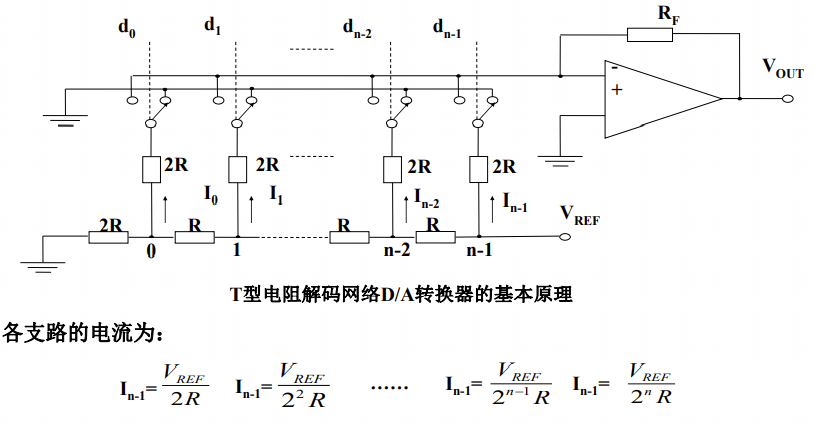

# 常见DAC转换器的工作原理

## D/A转换器的基本原理

D/A转换器是把输入的数字量转换为与之成正比的模拟量的器件。数字量不同位置值代表不同权重，输出模拟量是不同权重值的累加和。

如输入的数字量为D，$V_{Ref}$为基准电压，输出的模拟量为$V_0$，则有：
$$
V_0=\frac{D\times V_{Ref}}{2^n}\\
~\\
D=d_{n-1}2^{n-1}+d_{n-2}2^{n-2}+\cdots+d_12^1+d_02^0
$$

## D/A转换器的性能指标

### 分辨率

DAC能够产生的最小的模拟信号变化量，一般用最小模拟变化量与满量程信号值之比表示。如：8位（1/256），12位（1/4096）。

### 精度

DAC输出实际模拟量与理论值间的误差，同样分为绝对精度和相对精度。

### 建立时间

从数字量输入发生变化开始，到输出端模拟量稳定后，所需的时间，它是衡量DAC转换速度的重要参数。

## D/A转换的分类

### 按输入数字量的位数分

8位、10位、12位、16位等。

### 按输入的数码分

二进制方式和BCD码方式。

### 按数字量的输入方式分

并行方式和串行方式。

### 按输出形式分

电流输出型和电压输出型。

---

D/A转换一般由电阻解码网络、模拟电子开关、基准电压、运算放大器等组成。按电阻解码网络的组成形式，D/A转换器分成有权电阻解码网络D/A转换器、T型电阻解码网络D/A转换器和开关树型电阻解码网络D/A转换器等。T型电阻解码网络D/A转换器只用两种阻值的电阻，精度较高，容易集成化，在实际中使用最频繁。

## 反相比例放大器

