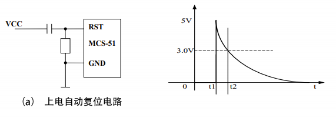
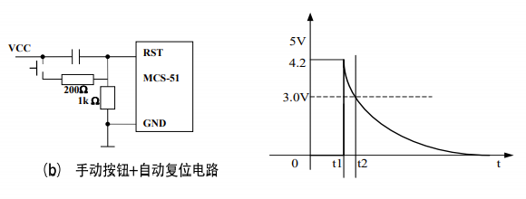
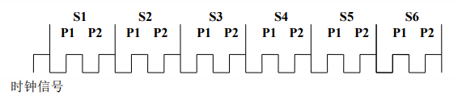

# 51单片机的工作周期和时序

## 复位方式

在时钟电路工作以后，当外部电路使得RST端出现2个机器周期以上的高电平，系统内部复位。复位有两种方式：**上电自动复位**和**手动按钮复位**。

## 机器周期和指令周期

### 机器周期

机器周期是单片机的基本操作周期。每个机器周期包含S1、S2、…、S6 六个状态，每个状态包含2拍P1和P2，每一拍为一个时钟周期（振荡周期)。因此，一个机器周期包含12个时钟周期。依次可表示为S1P1、S1P2、S2P1、S2P2、…、S6P1、S6P2。

### 指令周期

计算机工作时不断取指令和执行指令。计算机取一条指令至执行完该指令需要的时间成为指令周期，不同的指令，指令周期不同。单片机的指令周期以机器周期为单位。MCS-51系列单片机中，大多数指令的指令周期由一个或两个机器周期组成，只有乘法、除法指令需4个机器周期。