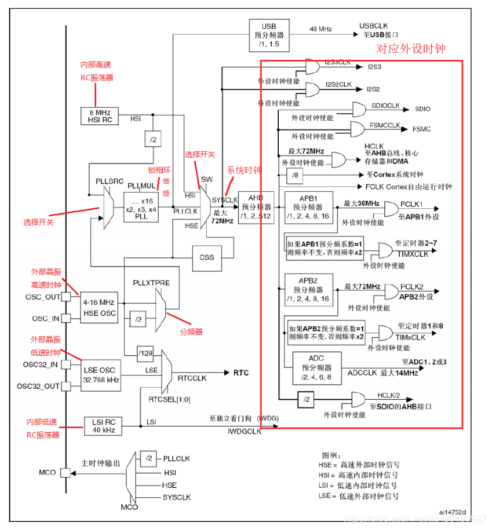
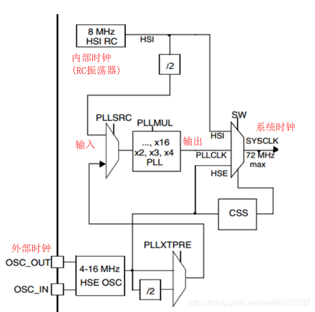
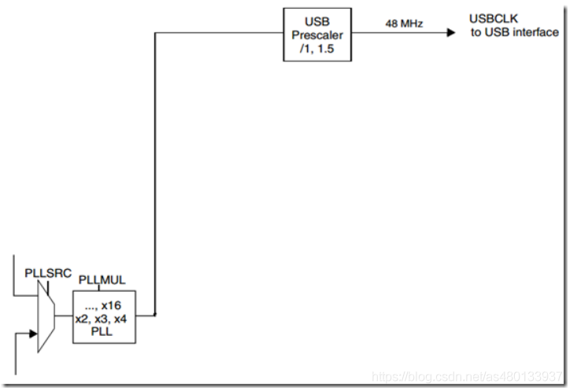
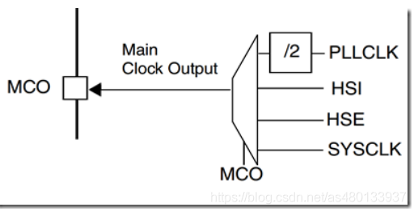
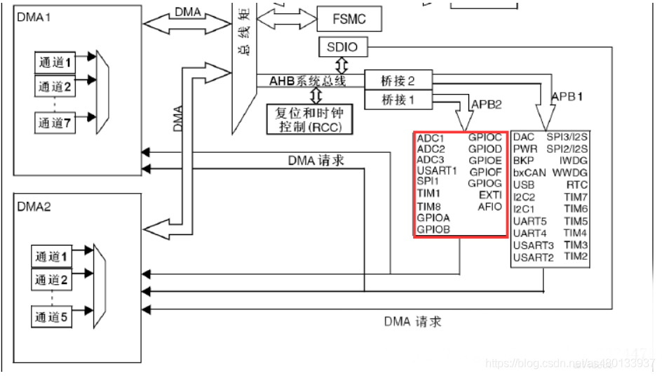
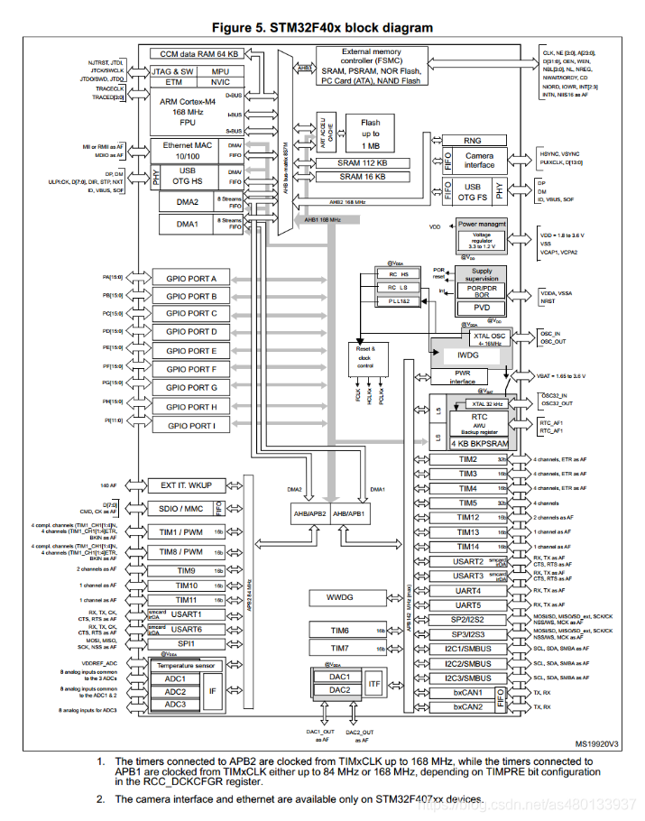
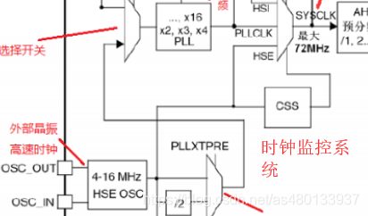

# STM32系统时钟RCC详解

> **参考：**
>
> [【STM32】系统时钟RCC详解(超详细，超全面)_Z小旋-CSDN博客](https://blog.csdn.net/as480133937/article/details/98845509)

## 什么是时钟

时钟是单片机运行的基础，时钟信号推动单片机内各个部分执行相应的指令。时钟系统就是CPU的脉搏，决定CPU速率，像人的心跳一样只有有了心跳，人才能做其他的事情，而单片机有了时钟，才能够运行执行指令，才能够做其他的处理 (点灯，串口，ADC)，时钟的重要性不言而喻。


### 为什么 STM32 要有多个时钟源

STM32本身十分复杂，外设非常多。但我们实际使用的时候只会用到有限的几个外设，使用任何外设都需要时钟才能启动，但并不是所有的外设都需要系统时钟那么高的频率，为了兼容不同速度的设备，有些高速，有些低速，如果都用高速时钟，势必造成浪费。并且，同一个电路，时钟越快功耗越快，同时抗电磁干扰能力也就越弱，所以较为复杂的MCU都是采用多时钟源的方法来解决这些问题。所以便有了STM32的时钟系统和时钟树。


### 总结

- STM32时钟系统主要的目的就是给相对独立的外设模块提供时钟，也是为了降低整个芯片的耗能。

- 系统时钟，是处理器运行时间基准（每一条机器指令一个时钟周期）。

- 时钟是单片机运行的基础，时钟信号推动单片机内各个部分执行相应的指令。

- 一个单片机内提供多个不同的系统时钟，可以适应更多的应用场合。

- 不同的功能模块会有不同的时钟上限，因此提供不同的时钟，也能在一个单片机内放置更多的功能模块。

- 对不同模块的时钟增加开启和关闭功能，可以降低单片机的功耗。STM32为了低功耗，将所有的外设时钟都设置为disable(不使能)，用到什么外设，只要打开对应外设的时钟就可以，其他的没用到的还是disable(不使能)，这样耗能就会减少。 这就是不管你配置什么功能都需要先打开对应的时钟的原因。

## 时钟系统

### STM32的时钟系统框图



> 看系统时钟SYSCLK的左边 ，系统时钟有很多种选择，而左边的部分就是设置系统时钟使用那个时钟源；
>
> 系统时钟SYSCLK的右边，则是系统时钟通过AHB预分频器，给相对应的外设设置相对应的时钟频率。
>
> 从左到右可以简单理解为 **各个时钟源—>系统时钟来源的设置—>各个外设时钟的设置**。

### 各个时钟源    (左边的部分)

> STM32 有4个独立时钟源: **HSI、HSE、LSI、LSE**。

- HSI是高速内部时钟，RC振荡器，频率为8MHz，精度不高。

- HSE是高速外部时钟，可接石英/陶瓷谐振器，或者接外部时钟源，频率范围为4MHz~16MHz。

- LSI是低速内部时钟，RC振荡器，频率为40kHz，提供低功耗时钟.

- LSE是低速外部时钟，接频率为32.768kHz的石英晶体。

其中LSI是作为IWDGCLK(独立看门狗)时钟源和RTC时钟源而独立使用。

而HSI高速内部时钟、HSE高速外部时钟、PLL锁相环时钟 ，这三个经过分频或者倍频，作为系统时钟来使用。

PLL为锁相环倍频输出，其时钟输入源可选择为HSI/2、HSE或者HSE/2。倍频可选择为2~16倍，但是其输出频率最大不得超过72MHz。通过倍频之后作为系统时钟的时钟源。

**举个例子**：

Keil编写程序默认的时钟为72Mhz，其实是这么来的：外部晶振(HSE)提供的8MHz（与电路板上的晶振的相关）通过PLLXTPRE分频器后，进入PLLSRC选择开关，进而通过PLLMUL锁相环进行倍频（x9）后，为系统提供72MHz的系统时钟（SYSCLK）。之后是AHB预分频器对时钟信号进行分频，然后为低速外设提供时钟。

或者内部RC振荡器(HSI) 为8MHz/2为4MHz，进入PLLSRC选择开关，通过PLLMUL锁相环进行倍频（x18）后为72MHz。

> PS:  网上有很多人说是5个时钟源，这种说法有点问题，PLL并不是自己产生的时钟源，而是通过其他三个时钟源倍频得到的。

### 系统时钟SYSCLK

> 系统时钟SYSCLK可来源于三个时钟源：**HSI振荡器时钟、HSE振荡器时钟、PLL时钟**。
> 最大为**72Mhz**。



### USB时钟

STM32中有一个全速功能的USB模块，其串行接口引擎需要一个频率为48MHz的时钟源。该时钟源只能从PLL输出端获取（唯一的），可以选择为1.5分频或者1分频，也就是当需要使用USB模块时，PLL必须使能，并且时钟频率配置为48MHz或72MHz。



### 把时钟信号输出到外部

STM32可以选择一个时钟信号输出到MCO脚(PA8)上，可以选择为PLL输出的2分频、HSI、HSE、或者系统时钟。可以把时钟信号输出供外部使用。



### 系统时钟通过AHB分频器给外设提供时钟(右边的部分) <font color=#ff3300>[ 重点]</font>

> 从左到右可以简单理解为 **系统时钟—>AHB分频器—>各个外设分频倍频器—>外设时钟的设置**

右边部分为：系统时钟SYSCLK通过AHB分频器分频后送给各模块使用，AHB分频器可选择1、2、4、8、16、64、128、256、512分频。其中AHB分频器输出的时钟送给5大模块使用： 

- 内核总线：送给AHB总线、内核、内存和DMA使用的HCLK时钟。 

- Tick定时器：通过8分频后送给Cortex的系统定时器时钟。 

- I2S总线：直接送给Cortex的空闲运行时钟FCLK。 

- APB1外设：送给APB1分频器。APB1分频器可选择1、2、4、8、16分频，其输出一路供APB1外设使用(PCLK1，最大频率36MHz)，另一路送给通用定时器使用。该倍频器可选择1或者2倍频，时钟输出供定时器2-7使用。 

- APB2外设：送给APB2分频器。APB2分频器可选择1、2、4、8、16分频，其输出一路供APB2外设使用(PCLK2，最大频率72MHz)，另一路送给高级定时器。该倍频器可选择1或者2倍频，时钟输出供定时器1和定时器8使用。 

另外，APB2分频器还有一路输出供ADC分频器使用，分频后送给ADC模块使用。ADC分频器可选择为2、4、6、8分频。 

需要注意的是，如果 APB 预分频器分频系数是 1，则定时器时钟频率 (TIMxCLK) 为 PCLKx。否则，定时器时钟频率将为 APB 域的频率的两倍：TIMxCLK = 2xPCLKx。 

### APB1和APB2的对应外设

#### F1系列



APB1上面连接的是低速外设，包括电源接口、备份接口、CAN、USB、I2C1、I2C2、USART2、USART3、UART4、UART5、SPI2、SP3等。

而APB2上面连接的是高速外设，包括UART1、SPI1、Timer1、ADC1、ADC2、ADC3、所有的普通I/O口（PA-PE）、第二功能I/O（AFIO）口等。

#### F4系列



和F1系列类似，仅举几个特殊的。

APB2总线：高级定时器timer1，timer8以及通用定时器timer9，timer10，timer11，UTART1，USART6。

APB1总线：通用定时器timer2 ~ timer5，通用定时器timer12 ~ timer14以及基本定时器timer6，timer7，UTART2 ~ UTART5。

F4系列的系统时钟频率最高能到168M。

具体可以在 `stm32f10x_rcc.h stm32f40x_rcc.h` 中查看，或者通过STM32参考手册搜索“系统架构”或者“系统结构” 查看外设挂在哪个时钟下。

### RCC相关寄存器

> 以F1系列为例。

```c
//RCC寄存器结构，RCC_TypeDef，在文件“stm32f10x.h”中定义如下:
//1059行->1081行:
typedef struct{
vu32 CR;//HSI,HSE, CSS,PLL等的使能
vu32 CFGR;//PLL等的时钟源选择以及分频系数设定
vu32 CIR;//清除/使能时钟就绪中断
vu32 APB2RSTR;//APB2线上外设复位寄存器
vu32 APB1RSTR;//APB1线上外设复位寄存器
vu32 AHBENR;//DMA，SDIO等时钟使能
vu32 APB2ENR;//APB2线上外设时钟使能
vu32APB1ENR;//APB1线上外设时钟使能
vu32 BDCR;//备份域控制寄存器
vu32 CSR;
} RCC_TypeDef;
```

### RCC初始化
> 这里我们使用HSE(外部时钟），正常使用的时候也都是使用外部时钟。

使用HSE时钟，程序设置时钟参数流程：

1. 将RCC寄存器重新设置为默认值   RCC_DeInit;
2. 打开外部高速时钟晶振HSE       RCC_HSEConfig(RCC_HSE_ON);
3. 等待外部高速时钟晶振工作      HSEStartUpStatus = RCC_WaitForHSEStartUp();
4. 设置AHB时钟         RCC_HCLKConfig;
5. 设置高速AHB时钟     RCC_PCLK2Config;
6. 设置低速速AHB时钟   RCC_PCLK1Config;
7. 设置PLL              RCC_PLLConfig;
8. 打开PLL              RCC_PLLCmd(ENABLE);
9. 等待PLL工作          while(RCC_GetFlagStatus(RCC_FLAG_PLLRDY) == RESET)
10. 设置系统时钟        RCC_SYSCLKConfig;
11. 判断是否PLL是系统时钟     while(RCC_GetSYSCLKSource() != 0x08)
12. 打开要使用的外设时钟      RCC_APB2PeriphClockCmd()/RCC_APB1PeriphClockCmd()

#### 代码实现：

> 对RCC的配置函数(使用外部8MHz晶振) 。
>
> 系统时钟72MHz，APH 72MHz，APB2 72MHz，APB1 32MHz，USB 48MHz，TIMCLK=72M。

```c
void RCC_Configuration(void)
{
	//-----------------使用外部RC晶振--------------------//
	RCC_DeInit();			//初始化为缺省值
	RCC_HSEConfig(RCC_HSE_ON);	//使能外部的高速时钟 
	while(RCC_GetFlagStatus(RCC_FLAG_HSERDY) == RESET);	//等待外部高速时钟使能就绪
	FLASH_PrefetchBufferCmd(FLASH_PrefetchBuffer_Enable);	//Enable Prefetch Buffer
	FLASH_SetLatency(FLASH_Latency_2);		//Flash 2 wait state
	RCC_HCLKConfig(RCC_SYSCLK_Div1);		//HCLK = SYSCLK
	RCC_PCLK2Config(RCC_HCLK_Div1);			//PCLK2 =  HCLK
	RCC_PCLK1Config(RCC_HCLK_Div2);			//PCLK1 = HCLK/2
	RCC_PLLConfig(RCC_PLLSource_HSE_Div1,RCC_PLLMul_9);	//PLLCLK = 8MHZ * 9 =72MHZ
	RCC_PLLCmd(ENABLE);			//Enable PLLCLK
	while(RCC_GetFlagStatus(RCC_FLAG_PLLRDY) == RESET);	//Wait till PLLCLK is ready
	RCC_SYSCLKConfig(RCC_SYSCLKSource_PLLCLK);	//Select PLL as system clock
	while(RCC_GetSYSCLKSource()!=0x08);		//Wait till PLL is used as system clock source	
	//-----------------打开相应外设时钟-------------------//
	RCC_APB2PeriphClockCmd(RCC_APB2Periph_GPIOA,ENABLE);	//使能APB2外设的GPIOA的时钟		 
}
```

## 时钟监视系统（CSS）

STM32还提供了一个时钟监视系统（CSS），用于监视高速外部时钟（HSE）的工作状态。倘若HSE失效，会自动切换（高速内部时钟）HSI作为系统时钟的输入，保证系统的正常运行。

