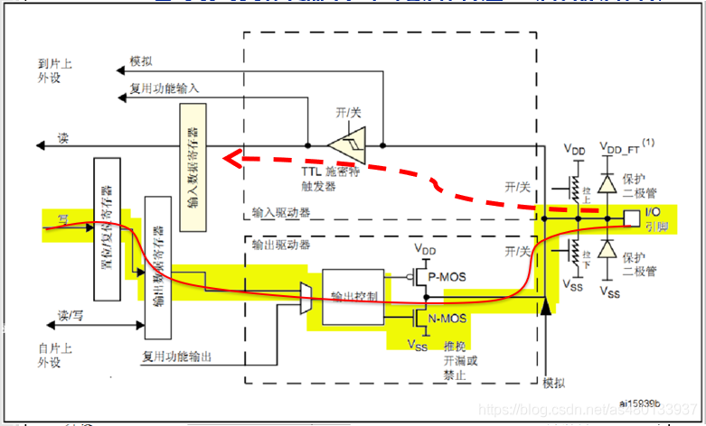

# (STM32F4)GPIO八种模式及工作原理详解

> 参考：
>
> [STM32F4-GPIO八种模式及工作原理详解-Z小旋-CSDN博客](https://blog.csdn.net/as480133937/article/details/98063549)

## GPIO简介

### GPIO是什么

GPIO，即**通用I/O(输入/输出)端口**，是STM32可控制的引脚。STM32芯片的GPIO引脚与外部设备连接起来，可实现与外部通讯、控制外部硬件或者采集外部硬件数据的功能。

**STM32F407有7组IO。**分别为GPIOA~GPIOG，每组IO有16个IO口，共有112个IO口 ，通常称为 PAx、PBx、PCx、PDx、PEx、PFx、PGx，其中x为0-15。F4系列是基于**Cortex-M4**内核。

### GPIO的复用

STM32F4有很多的内置外设，这些外设的外部引脚都是与GPIO共用的。也就是说，一个引脚可以有很多作用，但是**默认为IO口**，如果想使用一个GPIO内置外设的功能引脚，就需要GPIO的复用，那么当这个 GPIO 作为内置外设使用的时候，就叫做**复用**。比如说串口就是GPIO复用。

## GPIO的工作模式

### 4种输入模式

- GPIO_Mode_IN_FLOATING 浮空输入
- GPIO_Mode_IPU 上拉输入
- GPIO_Mode_IPD 下拉输入
- GPIO_Mode_AIN 模拟输入

### 4种输出模式 

- GPIO_Mode_Out_OD 开漏输出（带上拉或者下拉）
- GPIO_Mode_AF_OD 复用开漏输出（带上拉或者下拉）
- GPIO_Mode_Out_PP 推挽输出（带上拉或者下拉）
- GPIO_Mode_AF_PP 复用推挽输出（带上拉或者下拉）

### 4种最大输出速度

- 2MHZ  (低速)
- 25MHZ  (中速)
- 50MHZ  (快速)
- 100MHZ  (高速)

> 它们的定义都在`stm32f4xx_gpio.h`中，定义为结构体形式。

## GPIO框图剖析


- **保护二极管**：IO引脚上下两边两个二极管用于防止引脚外部过高、过低的电压输入，当引脚电压高于VDD_FT时，上方的二极管导通，当引脚电压低于VSS时，下方的二极管导通，防止不正常电压引入芯片导致芯片烧毁。

- **上拉、下拉电阻**：控制引脚默认状态的电压，开启上拉的时候引脚默认电压为高电平，开启下拉的时候引脚默认电压为低电平。

- **TTL施密特触发器**：基本原理是当输入电压高于正向阈值电压，输出为高；当输入电压低于负向阈值电压，输出为低；IO口信号经过触发器后，模拟信号转化为0和1的数字信号，也就是高低电平，并且是TTL电平协议。

- **P-MOS管和N-MOS管**：信号由P-MOS管和N-MOS管，依据两个MOS管的工作方式，使得GPIO具有“推挽输出”和“开漏输出”的模式。P-MOS管高电平导通，低电平关闭，下方的N-MOS低电平导通，高电平关闭。

- **VDD_FT**：代表IO口兼容3.3V和5V，如果没有标注“FT”，就代表着不兼容5V。

## GPIO的八种工作模式剖析

### 浮空输入模式


浮空输入模式下，I/O端口的电平信号直接进入输入数据寄存器。MCU直接读取I/O口电平，I/O的电平状态是不确定的，完全由外部输入决定；如果在该引脚悬空（在无信号输入）的情况下，读取该端口的电平是不确定的。 (接用电压表测量其引脚电压为1点几伏，这是个不确定值) 可以用来做KEY识别。

### 上拉输入模式


IO内部接上拉电阻，此时如果IO口外部没有信号输入或者引脚悬空，IO口默认为高电平；如果I/O口输入低电平，那么引脚就为低电平，MCU读取到的就是低电平。

STM32的内部上拉是"**弱上拉**"，即通过此上拉输出的电流是很弱的，如要求大电流还是需要外部上拉。

### 下拉输入模式


IO内部接下拉电阻，此时如果IO口外部没有信号输入或者引脚悬空，IO口默认为低电平；如果I/O口输入高电平，那么引脚就为高电平，MCU读取到的就是高电平。

### 模拟输入模式


当GPIO引脚用于**ADC采集电压**的输入通道时，用作"模拟输入"功能，此时**信号不经过施密特触发器**，直接直接进入ADC模块，并且输入数据寄存器为空 ，CPU不能在输入数据寄存器上读到引脚状态。当GPIO用于模拟功能时，**引脚的上、下拉电阻是不起作用的**，这个时候即使配置了上拉或下拉模式，也不会影响到模拟信号的输入输出。

> **除了ADC和DAC要将IO配置为模拟通道之外，其他外设功能一律要配置为复用功能模式。**

### 开漏输出模式（带上拉或者下拉）



在开漏输出模式时，**只有N-MOS管工作**，如果我们控制输出为0，低电平，则P-MOS管关闭，N-MOS管导通，使输出低电平，I/O端口的电平就是低电平，若控制输出为1时，高电平，则P-MOS管和N-MOS管都关闭，输出指令就不会起到作用，此时**I/O端口的电平就不由输出的高电平决定，而是由I/O端口外部的上拉或者下拉决定**。**如果没有上拉或者下拉 IO口就处于悬空状态**。并且**此时施密特触发器是打开的**，即输入可用，通过输入数据寄存器GPIOx_IDR可读取I/O的实际状态，I/O口的电平不一定是输出的电平。

### 推挽输出模式（带上拉或者下拉）


在推挽输出模式时，**N-MOS管和P-MOS管都工作**，如果控制输出为0，低电平，则P-MOS管关闭，N-MOS管导通，使输出低电平，I/O端口的电平就是低电平；若控制输出为1，高电平，则P-MOS管导通N-MOS管关闭，使输出高电平，I/O端口的电平就是高电平， **外部上拉和下拉的作用是控制在没有输出时IO口电平**。**此时施密特触发器是打开的**，即输入可用，通过输入数据寄存器GPIOx_IDR可读取I/O的实际状态。I/O口的电平一定是输出的电平。

### 复用开漏输出（带上拉或者下拉）


GPIO复用为其他外设，**输出数据寄存器GPIOx_ODR无效**；输出的高低电平的来源于其它外设，施密特触发器打开，输入可用，通过输入数据寄存器可获取I/O实际状态。**除了输出信号的来源改变，其他与开漏输出功能相同。**

### 复用推挽输出（带上拉或者下拉）


GPIO复用为其他外设(如 I2C)，**输出数据寄存器GPIOx_ODR无效**；输出的高低电平的来源于其它外设，施密特触发器打开，输入可用，通过输入数据寄存器可获取I/O实际状态。**除了输出信号的来源改变，其他与开漏输出功能相同。**

### 开漏输出和推挽输出的区别

#### 推挽输出：

**可以输出强高低电平，连接数字器件。**

推挽结构一般是指两个三极管分别受两互补信号的控制，总是在一个三极管导通的时候另一个截止。

#### 开漏输出：

可以输出强低电平，高电平得靠外部电阻拉高。输出端相当于三极管的集电极。

需要外接上拉电阻，才能实现输出高电平。合于做电流型的驱动，其吸收电流的能力相对强(一般20mA以内)。

**在使用任何一种开漏模式时，都需要接上拉电阻，否则只能输出低电平。**


#### 推挽输出电路：

其中IN端输出高电平时下面的PNP三极管截止，而上面NPN三极管导通，输出电平VS+；当IN端输出低电平时则恰恰相反，PNP三极管导通，输出和地相连，为低电平。

#### 开漏输出电路：

N端输出低电平时，三极管导通，使输出接地，IN端输出高电平时，三极管截止，所以引脚既不输出高电平，也不输出低电平，为高阻态。为正常使用时必须接上拉电阻。

### F4系列与F1系列的区别

本质上的区别是F4系列采用**Cortex-M4内核**，F1系列采用**Cortex-M3内核**。

#### F1系列(M3)IO口基本结构：


#### F4系列(M4)IO口基本结构：


> F4系列设计的更加高级与人性化，将**外部上下拉电阻转移到了输出/输入驱动器外部，使得输出模式下也可以实现内部上拉与下拉**，方便了用户的使用，增加了灵活性。

## GPIO的初始化(F4)

> 以初始化LED为例。

### STEP1 定义一个 GPIO_InitTypeDef 类型的结构体

```c
GPIO_InitTypeDef GPIO_InitStructure;
typedef struct
{
    uint32_t GPIO_Pin;
    GPIOMode_TypeDef GPIO_Mode;
    GPIOSpeed_TypeDef GPIO_Speed;
    GPIOOType_TypeDef GPIO_OType;
    GPIOPuPd_TypeDef GPIO_PuPd;
}GPIO_InitTypeDef;
```

### STEP2 开启LED相关的GPIO外设时钟

```c
RCC_AHB1PeriphClockCmd(RCC_AHB1Periph_GPIOB, ENABLE); //开启AHB1时钟

/* Q：为什么要设置时钟？
   A：任何外设都需要时钟，51单片机，stm32，430等等，因为寄存器是由触发器组成的，往触发器里面写东西，前提条件是有时钟输入。stm32是低功耗，他将所有的门都默认设置为disable(不使能)，在你需要用哪个门的时候，开哪个门就可以，也就是说用到什么外设，只要打开对应外设的时钟就可以，其他的没用到的可以还是disable(不使能)，这样耗能就会减少。*/
```

### STEP3 选择要控制的 GPIO 引脚

`GPIO_InitStructure.GPIO_Pin = GPIO_Pin_9; //选择Pin9引脚`

### STEP4 设置所选引脚的模式

`GPIO_InitStructure.GPIO_Mode = GPIO_Mode_OUT; //设定为输出模式`

### STEP5  设定所选引脚的输出类型

`GPIO_InitStructure.GPIO_OType = GPIO_OType_PP; //设置引脚的输出类型为推挽输出`

### STEP6 设定所选管脚的速度

 `GPIO_InitStructure.GPIO_Speed = GPIO_Speed_100MHz; //设定速度为100MHz高速模式`

### STEP7 设定所选管脚的上拉与下拉

`GPIO_InitStructure.GPIO_PuPd = GPIO_PuPd_UP; //设置引脚为上拉模式`

### STEP8 初始化GPIO

 `GPIO_Init(GPIOB, &GPIO_InitStructure); //初始化所设置的引脚`

## GPIO的初始化(F1)

> F4的初始化相较于F1系列有了很大的改变，在配置F1系列时，结构体只有三个参数。

F1的`GPIO_InitTypeDef`结构体只有三个参数。8种模式全部定义在`GPIOMode_TypeDef`中。

```c
typedef struct
{
    uint32_t GPIO_Pin;
    GPIOSpeed_TypeDef GPIO_Speed;
    GPIOMode_TypeDef GPIO_Mode;
}GPIO_InitTypeDef;

void led_init(void)
{
    GPIO_InitTypeDef GPIO_InitStruct;                    //定义初始化结构体
    RCC_APB2PeriphClockCmd(RCC_APB2Periph_GPIOA,ENABLE); //使能GPIOA时钟
    GPIO_InitStruct.GPIO_Mode  = GPIO_Mode_Out_PP;       //配置模式
    GPIO_InitStruct.GPIO_Pin   = GPIO_Pin_0;             //配置IO口
    GPIO_InitStruct.GPIO_Speed = GPIO_Speed_50MHz;       //配置IO口速度,仅输出有效
    GPIO_Init(GPIOA,&GPIO_InitStruct);                   //初始化GPIOA的参数为以上结构体
}
```
