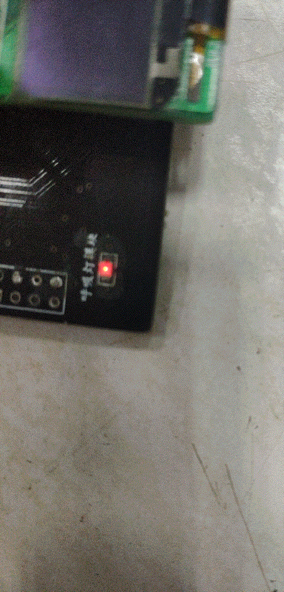
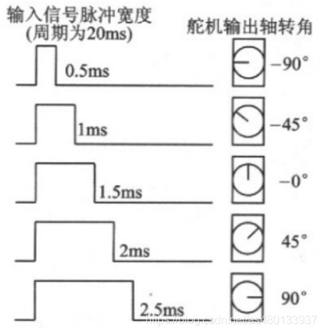

# PWM

> 参考：
>
> [PWM原理_PWM频率与占空比详解_Z小旋-CSDN博客](https://blog.csdn.net/as480133937/article/details/103439546)

## 什么是PWM

脉冲宽度调制(PWM)，是英文**Pulse Width Modulation**的缩写，简称脉宽调制，是利用微处理器的数字输出来对模拟电路进行控制的一种非常有效的技术，广泛应用在从测量、通信到功率控制与变换的许多领域中。

## 相关名词

### pwm的频率

是指**1秒钟内信号从高电平到低电平再回到高电平的次数**(一个周期)，也就是一秒钟PWM有多少个周期。
单位：Hz
表示方式：50Hz 100Hz

### pwm的周期

T=1/f
**周期=1/频率**
50Hz = 20ms 一个周期
如果频率为50Hz ，也就是说一个周期是20ms，那么一秒钟就有50次PWM周期。

### 占空比
是一个脉冲周期内，**高电平的时间**与**整个周期时间**的比例。
单位：% (0%-100%)
表示方式：20%
以20Hz占空比为80%举例，就是1秒钟之内输出了20次脉冲信号，每次的高电平时间为40ms。

## PWM原理

以单片机为例，单片机的IO口输出的是数字信号，**IO口只能输出高电平和低电平**。

假设高电平为5V，低电平则为0V，那么我们要输出不同的模拟电压，就要用到PWM，通过改变IO口输出的方波的占空比从而获得**使用数字信号模拟成的模拟电压信号**。

电压是以一种连接1或断开0的重复脉冲序列被加到模拟负载上去的（例如LED，直流电机等），连接即是直流供电输出，断开即是直流供电断开。通过对连接和断开时间的控制，理论上来讲，可以输出任意不大于最大电压值（即0~5V之间任意大小）的模拟电压。

例如，占空比为50% 那就是高电平时间一半，低电平时间一半，在一定的频率下，就可以得到模拟的2.5V输出电压；那么75%的占空比，得到的电压就是 $ 0V\times0.25 + 5V\times0.75 = 3.75V$.

pwm的调节作用来源于对“占周期”的宽度控制，“占周期”变宽，输出的能量就会提高，通过阻容变换电路所得到的平均电压值也会上升，“占周期”变窄，输出的电压信号的电压平均值就会降低，通过阻容变换电路所得到的平均电压值也会下降,也就是，在一定的频率下，通过不同的占空比 即可得到不同的输出模拟电压.

pwm就是通过这种原理实现D/A转换的。

### 总结
PWM就是在合适的信号频率下，通过一个周期里改变占空比的方式来改变输出的有效电压。

## 实例

### PWM输出呼吸灯
那么，PWM信号的实际作用是什么呢？

我们以经常使用的呼吸灯举例：

一般人眼睛对于80Hz以上刷新频率则完全没有闪烁感。

频率太小的话，看起来就会闪烁。

那么我们平时见到的LED灯，当它的频率大于50Hz的时候，人眼就会产生视觉暂留效果，基本就看不到闪烁了，而是一个常亮的LED灯。

在1秒内，高电平0.5秒，低电平0.5秒(频率1Hz)，如此反复，那么看到的电灯就会闪烁；但是如果是10毫秒内，5毫秒打开，5毫秒关闭(频率100Hz)，这时候灯光的亮灭速度赶不上开关速度(LED灯还没完全亮就又熄灭了)，由于视觉暂留作用 人眼不感觉电灯在闪烁，而是感觉灯的亮度变低了。

频率很高时，看不到闪烁，占空比越大，LED越亮；频率很低时，可看到闪烁，占空比越大，LED越亮。

所以，在频率一定下，可以用不同占空比改变LED灯的亮度，达到一个呼吸灯的效果。

### PWM对电机转速的控制
占空比可以实现对电机转速的调节。对于直流电机来讲，电机输出端引脚是高电平电机就可以转动，当输出端高电平时，电机会转动，但是是一点一点的提速，在高电平突然转向低电平时，电机由于电感有防止电流突变的作用是不会停止的，会保持这原有的转速，以此往复，电机的转速就是周期内输出的平均电压值，所以实质上我们调速是将电机处于一种，似停非停，似全速转动又非全速转动的状态，那么在一个周期的平均速度就是我们占空比调出来的速度了。

在电机控制中，电压越大，电机转速越快，而通过PWM输出不同的模拟电压，便可以使电机达到不同的输出转速。

当然，在电机控制中，不同的电机都有其适应的频率。频率太低会导致运动不稳定，如果频率刚好在人耳听觉范围，有时还会听到呼啸声。频率太高电机可能反应不过来。**正常的电机频率在 6-16kHz之间为好。**

### PWM对舵机的控制

舵机的控制就是通过一个固定的频率，给其不同的占空比，来控制舵机不同的转角。

舵机的频率一般为频率为50HZ，也就是一个20ms左右的时基脉冲，而脉冲的高电平部分一般为0.5ms-2.5ms范围。来控制舵机不同的转角。

500-2500us的PWM高电平部分对应控制180度舵机的0\~180度。

以180度角度伺服为例，那么对应的控制关系是这样的：

