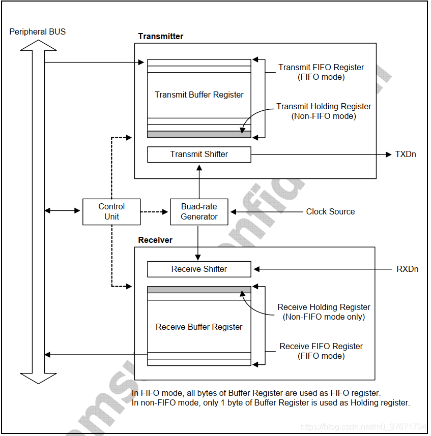
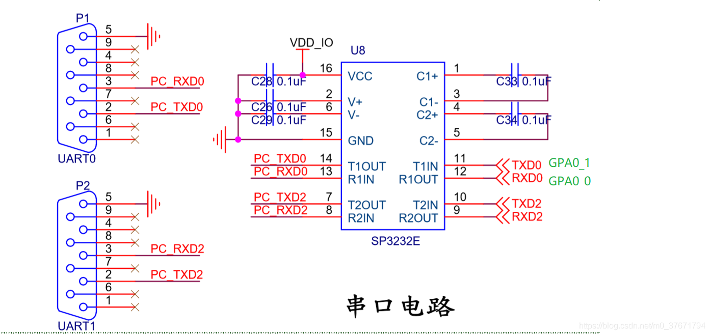

# 串口通信

> 参考：
>
> [串口通信详解-泪无痕的博客-CSDN博客](https://blog.csdn.net/m0_37671794/article/details/108416003)

## 通信的基础概念

### 通信的发展

#### 通信方式

狼烟 $\rightarrow$ 信件 $\rightarrow$ 电子通信（电报、电话、网络信号）。

#### 通信的要素

**信息表示**、**传输方法**、**解析方法 **。

> 通信双方事先需要约定好信息的表示方法和解析方法，做到一致，否则信息不能有效传递。
>
> 通信的传输方法是指经过编码后的通信信息如果在传输介质上传输的过程。

#### 总结
通信过程分为3个步骤：

$\boxed{发送方按照信息编码方式对有效信息进行编码} \rightarrow \boxed{编码后的信息在传输介质上进行传输给接收方} \rightarrow \boxed{接收方接到编码信息后进行解码，得到可以理解的有效信息}$

### 电子通信的相关概念

#### 同步通信与异步通信

- **同步**：发送方和接收方按照同一个时钟节拍工作。

- **异步**：发送方和接收方没有统一的时钟节拍、而各自按照自己的节拍工作。

> 同步通信中，通信双方按照统一节拍工作，所以配合很好；一般需要发送方给接收方发送信息同时发送时钟信号，接收方根据发送方给它的时钟信号来安排自己的节奏。同步通信用在通信双方信息交换频率固定或者经常通信的情况。
>
> 异步通信，又叫异步通知。在双方通信的频率不固定时（例如有时3ms收发一次，有时3天才收发一次），不适合使用同步通信。异步通信时接收方不必一直在意发送方，发送方需要发送信息时会首先给接收方一个信息开始的起始信号，接收方接收到起始信号后就认为后面紧跟着的就是有效信息，才会开始注意接收信息，直到收到发送方发过来的结束标志。

#### 电平信号与差分信号

> 电平信号和差分信号是用来**描述通信线路传输方式**的，也就是说如何在通信线路上表示1和0。

- **电平信号**的传输线中有一个参考电平线(一般是GND)，然后信号线上的信号值是由**信号线电平和参考电平线的电压差**决定。

- **差分信号**的传输线中没有参考电平线，所有都是信号线，然后1和0的表达靠**信号线之间的电压差**。

> 电平信号的两根通信线之间的电平差异容易受到干扰，传输容易失败；差分信号不容易受到干扰，因此传输质量比较稳定。现代通信一般都使用差分信号。在相同根数的通信线下，**差分信号比电平信号要快**，因为**差分信号抗干扰能力强**，因此发送周期更短。
#### 并行接口与串行接口

> 串行、并行主要是考虑通信线的根数，就是发送方和接收方同时可以传递的信息量的多少。

- 串行：`1*参考电平线(信号地线)+1*信号线`可以传递1位二进制；`1*信号地线+2*信号线`可以同时发送2位二进制；如果想同时发送8位二进制就需要9根线(`1*信号地线+8*信号线`)。

- 并行：`2根线(彼此差分)`可以同时发送1位二进制；如果需要同时发送8位二进制就需要16根线(`8*信号地线+8*信号线`)。

> 串行接口使用的更加广泛，因为更省信号线，而且对传输线的要求更低、成本更低；而且串行时可以通过提高通信速度来提高总体通信性能，不一定比并行慢。

#### 总结 

经过多年的发展，现在的趋势：异步、串行、差分，例如USB和网络通信。

## 串口通信的基本概念

### 串口通信特点

#### 异步

串口通信的发送方和接收方使用各自的时钟信号。

#### 电平信号（早期）

串口通信出现的时间较早、速率较低、传输的距离较近，所有干扰不太明显，因此当时使用了电平信号传输。**后期出现的传输协议都改成了差分信号。**

#### 串行通信

串口通信每次同时只能传输**1个二进制位**。

### RS232电平和TTL电平

电平信号是用信号线电平减去参考线电平得到的电压差决定传输值是1还是0。

在电平信号中多少V代表1，多少V代表0是不固定的，取决于电平标准。例如，RS232电平中`-15V ~ -3V`表示1，`+3V ~ +15V`表示0；TTL电平中`+5V`表示1，`0V`表示0。

使用哪种电平区别在于适用的环境和条件不同。RS232电平适合干扰大、距离相对较远的情况（一般传输距离小于15米），用于工业上；TTL电平适合距离近且干扰小的情况，一般用在电路板内部的两个芯片之间。

对于编程来说，RS232电平传输和TTL电平传输是没有差异的。所以电平标准对硬件工程更有意义，而软件工程师只要略懂即可。

**注意：TTL电平和RS232电平不可混接。**

### 波特率

波特率指的是**串口通信的速率**，也就是**串口通信时每秒钟可以传输多少个二进制位**。例如，每秒钟可以传输9600个二进制位（传输一个二进制位需要的时间是1/9600秒），波特率就是9600。

**串口通信的波特率不能随意设定，而应该是在一些值中去选择。**一般最常见的波特率是**9600或115200**（低端单片机如51常用9600，高端单片机和嵌入式SOC常用115200）。

这主要是因为：通信双方必须事先设定相同的波特率才能成功通信，如果发送方和接收方的波特率不同则无法成功通信，因此波特率最好是大家熟知的而不是随意指定的。常用的波特率经过长久发展，就形成了共识，大家常用的就是9600或者115200。

### 起始位、数据位、奇偶校验位、停止位

串口通信时，收发是一个周期一个周期进行的，每个周期传输n个二进制位。这一个周期就叫做一个**通信单元**，一个通信单元由**起始位+数据位+奇偶校验位+停止位**组成。

#### 起始位

表示发送方要开始发送一个通信单元，起始位的定义是串口通信标准事先指定的，由通信线上的电平变化反映。

#### 数据位

一个通信单元中发送的有效信息位，是本次通信真正要发送的有效数据，串口通信一次发送多少位有效数据是可以设定的（可选的有6、7、8、9，一般都是选择8位数据位，因为一般通过串口发送的文字信息都是ASCII码编码，而ASCII码中一个字符刚好编码为8位）。

#### 校验位
用来校验数据位，以防止数据位出错。

#### 停止位
发送方用来表示本通信单元结束标志，停止位的定义是串口通信标准事先指定的，由通信线上的电平变化反映。常见的有1位停止位、1.5位停止位、2位停止位等，一般使用的是1位停止位。

#### 总结

串口通信时因为是异步通信，所以通信双方必须事先约定好通信参数，这些通信参数包括：**波特率、数据位、校验位、停止位（串口通信中起始位定义是唯一的，所以一般不用选择）**。

### 单工、半双工和全双工

- 单工：单方向收发数据，如只能A发送数据，B接收数据。
- 半双工：双方分时收发数据，如“A发送数据，B接收数据”或者“A接收数据，B发送数据”，两个方向不能同时进行。
- 全双工：双方同时收发数据，如“A发送数据，B接收数据”同时“A接收数据，B发送数据”，两个方向同时进行。

## 串口通信的基本原理

### 三根通信线：TX、RX、GND

任何通信都要有信息传输载体，有线或者无线。

串口通信是有线通信，是通过串口线来通信的。

串口线最少需要两根(GND和信号线)，可以实现单工通信；也可以使用3根通信线(TX、RX、GND)，来实现全双工通信。

一般开发板都会引出SOC上串口引脚直接输出TTL电平的接口，用的是插针式插座，每个串口引出的都有3根通信线(TX、RX、GND)，可以用这些插座直接连接外部的TTL电平的串口设备。
    
### 收发双方事先约定通信参数

串口通信属于基层基本性的通信规约，它自己本身不会去协商通信参数，需要通信前通信双方事先约定好通信参数。

串口通信的任何一个关键参数设置错误，都可能导致通信失败。例如如果波特率调错了，发送方发送没问题，但接收方接收到全是乱码。

### 信息以二进制流的方式在信道上传输

串口通信的发送方每隔一定时间（时间固定为1/波特率，单位是秒）将有效信息（1或者0）放到通信线上去，逐位的进行发送。

接收方通过定时（起始时间由读到起始位标志开始，间隔时间由波特率决定）读取通信线上的电平高低来区分发送给我的是1还是0。

依次读取数据位、奇偶校验位、停止位，停止位就表示这一个通信单元（帧）结束，然后中间是不定长短的非通信时间（发送方有可能紧接着就发送第二帧，也可能半天都不发第二帧，这就是异步通信），接下来就是第二帧，以此类推。

**总结**：波特率非常重要，波特率错了整个通信就乱套了；数据位、奇偶校验位、停止位也很重要，否则可能认不清数据。通过串口不管发数字、文本还是命令，都要先对发送内容进行编码，编码成二进制再进行逐位的发送。串口发送的一般都是ASCII码编码后的字符，所以一般设置数据位为8，刚好一帧发送1个字符。
    

### DB9接口介绍

DB9接口是串口通信早期比较常用的一种规范化接口。

串行通信在早期是计算机与外界通信的主要手段，那时候的计算机都有标准配置的串口以实现和外部通信。那时候就定义了一套标准的串口规约，DB9接口就是标准接口。

DB9接口中有9根通信线，其中3根很重要，为GND、TX、RX，必不可少；剩余6根都和流控有关，现代我们使用串口都是用来做调试一般都禁用流控，所以不会用到这6根。

一般使用串口时记得把流控禁止，否则可能发生意想不到的问题。

## S5PV210串行通信接口详解

### 串口的名称

串口的官方名称是：`Universal Asynchronous Receiver/Transmitter`，即通用异步收发器，英文缩写是`UART`，中文简称串口。

### 串口控制器工作原理框图

整个串口控制器包含`Transmitter`和`Receiver`两部分，这两部分功能彼此独立，Transmitter负责向外部发送信息，Receiver负责从外部接收信息。

总线角度来讲，**串口控制器是挂载在APB总线上的**，对编程有影响的是：将来计算串口控制器的源时钟时是以APB总线来计算的。

Transmitter由**发送缓冲区**和**发送移位寄存器**构成。我们要发送信息时，首先将信息进行编码(一般用ASCII码)成二进制流，然后将一帧数据(一般是8位)写入发送缓冲区(从这里以后程序就不用管了，剩下的发送部分由硬件自动完成)，最后发送移位寄存器会自动从发送缓冲区中读取一帧数据，然后自动移位(移位的目的是将一帧数据的各个位分别拿出来)将其发送到TX通信线上。

Receiver由**接收缓冲区**和**接收移位寄存器**构成。当有人通过串口线向我发送信息时，信息通过RX通信线进入接收移位寄存器中，然后接收移位寄存器自动移位并将该二进制位保存入接收缓冲区，接收完一帧数据后Receiver会产生一个中断给CPU，CPU收到中断后即可知道Receiver接收满了一帧数据，就会来读取这帧数据。

**总结**：

发送缓冲区和接收缓冲区是关键，发送移位寄存器和接收移位寄存器的工作都是自动的，不用编程控制，所以写串口代码就是：首先初始化串口控制器(包括发送控制器和接收控制器)，然后要发送信息时直接写入发送缓冲区，要接收信息时直接去接收缓冲区中读取即可。

软件工程师对串口操作的接口就是发送/接收缓冲区(实际就是寄存器，操作方式就是读写内存)。
串口控制器中有一个波特率发生器，其作用是产生串口发送/接收的时钟节拍。波特率发生器其实就是个时钟分频器，它的工作需要源时钟(从APB总线来)，然后内部将源时钟进行分频(需要软件设置寄存器来配置)得到目标时钟，然后再用这个目标时钟产生波特率(由硬件自动完成的)。

### FIFO模式及其作用

典型的串口设计，发送/接收缓冲区只有1字节，每次发送/接收只能处理1帧数据。这样在单片机中没什么问题，但是到复杂SOC中(一般有操作系统)就会有问题，会导致效率低下，因为CPU需要不断切换上下文。

解决方案就是想办法扩展串口控制器的发送/接收缓冲区，譬如将发送/接收缓冲区设置为64字节，CPU一次过来直接给发送缓冲区64字节的待发送数据，然后Transmitter慢慢发送，发送完再找CPU再要64字节数据。但是串口控制器本来的发送/接收缓冲区是固定的1字节大小的，所有做了个变相的扩展，就是FIFO。

**FIFO，即first in first out**，先进先出。FIFO其实是一种数据结构，这里这个大的缓冲区叫FIFO是因为这个缓冲区的工作方式类似于FIFO这种数据结构。CPU先将64字节的数据放到FIFO中，然后启动FIFO模式，FIFO每次会自动往发送缓冲区中添加1字节数据，最后进行移位操作传输数据。

### DMA模式及其作用
**DMA，即direct memory access**，直接内存访问。DMA本来是DSP(Digital Signal Processing)中的一种技术，DMA技术的核心就是在交换数据时不需要CPU参与，模块可以自己完成。DMA模式要解决的问题和FIFO模式是同一个问题，就是串口发送/接收让CPU反复切换上下文导致系统效率低下。

传统的串口工作方式(无FIFO无DMA)效率是最低的，适合低端单片机；高端单片机上CPU事务繁忙所以都需要串口能够自己完成大量数据发送/接收，这时候就需要FIFO或者DMA模式。FIFO模式是一种轻量级的解决方案(只能从一定程度上解决问题，譬如几十字节的数据)，DMA模式适合大量数据的发送/接收(可以从根本上解决问题，可处理大量的数据)。

### 串口通信与中断的关系

串口通信分为发送/接收两部分。从理论上，发送方和接收方都可以选择使用/不使用中断，但**发送一般不需要中断即可完成发送，接收一般使用中断来接收。**

- 发送方使用中断的工作情景是：发送方先设置好中断并绑定一个中断处理程序，然后发送方丢一帧数据给Transmitter，Transmitter耗费一段时间来发送这一帧数据，这段时间内发送方CPU可以去做别的事情，等Transmitter发送完成后会产生一个TXD中断，该中断会导致事先绑定的中断处理程序执行，在中断处理程序中CPU会切换回来继续给Transmitter放一帧数据，然后CPU切换离开；

- 发送方不使用中断的工作情景是：发送方事先禁止TXD中断，发送方CPU给一帧数据到Transmitter，然后Transmitter耗费一段时间来发送这帧数据，这段时间CPU在这等着（CPU没有切换去做别的事情），待发送方发送完成后CPU再给它一帧数据继续发送直到所有数据发完。CPU是怎么知道Transmitter已经发送完了？原来是有个状态寄存器，状态寄存器中有一个位叫**发送缓冲区空标志**，Transmitter发送完成（发送缓冲区空了）就会给这个标志位置1，CPU就是通过不断查询这个标志位为1还是0来知道发送是否已经完成的。

- 接收方使用中断的工作情景是：接收方先设置好中断并绑定一个中断处理程序，然后接收方会耗费一段时间从Receiver中来接收一帧数据，这段时间内接收方CPU可以去做别的事情，等receiver接收数据完成后会产生一个RXD中断，该中断会导致事先绑定的中断处理程序执行，在中断处理程序中CPU会切换回来从Receiver中读取数据，然后CPU切换离开；

- 接收方不使用中断的工作情景是：接收方事先禁止RXD中断，接收方会耗费一段时间从receiver中接收一帧数据，这段时间CPU在这等着（CPU没有切换去做别的事情），Receiver接收完成（接收缓冲区满了）就会给**接收缓冲区满标志**位置1，CPU就是通过不断查询这个标志位为1还是0来知道接收是否已经完成的。

因为**串口通信是异步的**，异步的意思就是说发送方占主导权。也就是说发送方随时想发就能发，但是接收方只有时刻等待才不会丢失数据。所以**这个差异就导致发送方可以不用中断，而接收方不得不使用中断模式**。

### 串行通信接口的时钟设计

串口通信为什么需要时钟？因为串口通信需要一个固定的波特率，所以Transmitter和Receiver都需要一个时钟信号。

时钟信号从哪里来？源时钟信号是外部APB总线（PCLK_PSYS，66MHz）提供给串口模块的（这就是为什么我们说串口是挂载在APB总线上的），然后进到串口控制器内部后给波特率发生器（实质上是一个分频器），在波特率发生器中进行分频，分频后得到一个低频时钟，这个时钟就是给Transmitter和Receiver使用的。

串口通信中时钟的设置主要看寄存器设置。重点的有：寄存器源设置（为串口控制器选择源时钟，一般选择为**PCLK_PSYS**，也可以是**SCLK_UART**），还有波特率发生器的2个寄存器。波特率发生器有2个重要寄存器：**UBRDIVn和UDIVSLOTn**，其中UBRDIVn是主要的设置波特率的寄存器，UDIVSLOTn是用来辅助设置的，目的是为了校准波特率。

## 电路图

